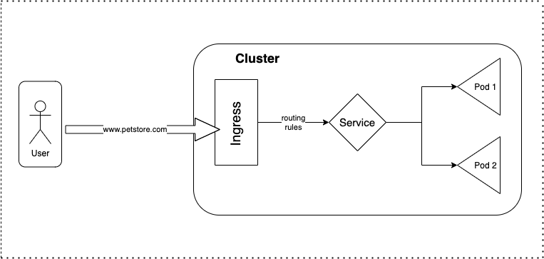
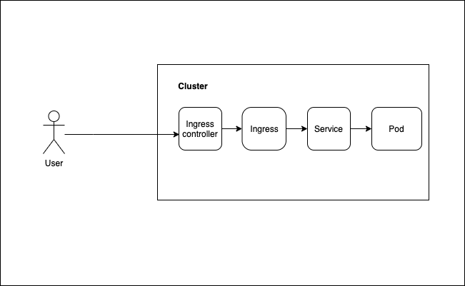
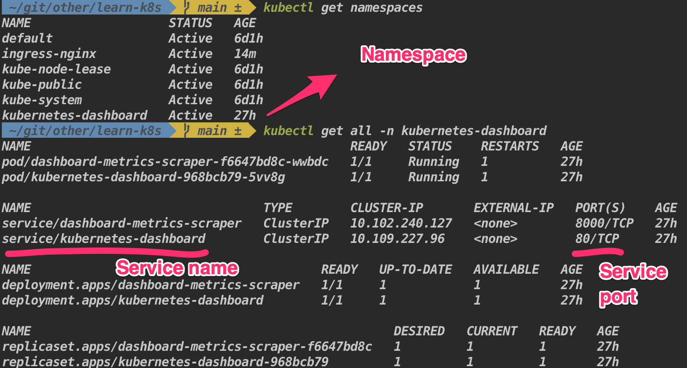
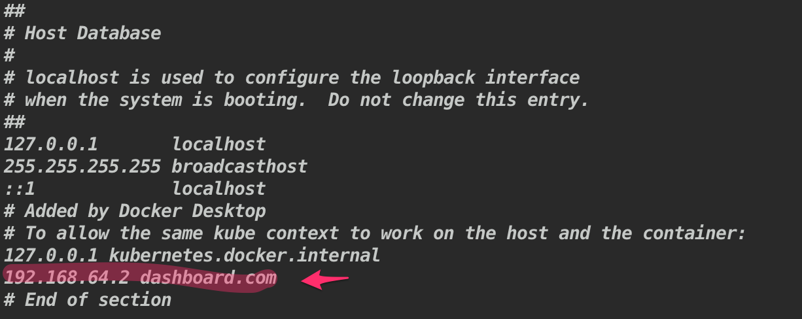

# Learn Kubernetes

## What is K8s ?

It is a popular container orchestrator tool.

## Why do you need K8s and what problem does it solves ?

Trends of micro services has increased the usage of containers and to handle these containers efficiently, need an 
orchestrator tool like k8s. Orchestration tool helps in automating the deployment, managing, scaling, and networking of containers, 
elf healing, high availability and Automated rollouts and rollbacks.


## Kubernetes architecture and basic terminologies


Image source - Red hat - [Introduction to Kubernetes architecture](https://www.redhat.com/en/topics/containers/kubernetes-architecture)

* Kubernetes - The whole orchestration system

### Control plane / Master node

* **kube-apiserver** - It's an entry point to interact with Kubernetes API (acts as a gateway). It determines if a request is valid 
and, if it is, processes it. It can be accessed through the kubectl cmd or kubeadm.

* **kube-scheduler** - It considers the resource needs of a pod, such as CPU or memory, along with the health of the cluster. Then it 
schedules the pod to an appropriate compute node. Then it passes on the requests to kubelet to execute it.

* **kube-controller-manager** - Detects state changes in the cluster (eg: if pod crashes, detects it and recovers the cluster state). 
Checks with scheduler and makes sure the correct number of pods is running.

* **etcd** - It is a key-value store database, stores the cluster state. All of the cluster information (eg: new pod created, pod 
crashed) is stored in the etcd.

### Compute machine / Worker node

* **kubelet** - Kubernetes agent running on nodes, a tiny application that communicates with the control plane & containers vice versa
and when the control plane needs something to happen in a node, the kubelet executes the action. It ensures the containers are 
running in the pod.

* **kube-proxy** - The kube-proxy handles network communications inside or outside of your cluster. It uses operating system’s packet 
filtering layer if there is one, otherwise , kube-proxy forwards the traffic itself.

* **container runtime** - It is the software responsible for running containers. It can be Docker, Containerd and CRI-O.

## Q&A

<details>

  <summary> 1. What are the main components of kubernetes ? </summary>

  &nbsp;

  <p align="center">
    
      &nbsp; &nbsp; &nbsp; &nbsp;
    
  </p>

  Image source of [Kubernetes object](https://tsuyoshiushio.medium.com/kubernetes-in-three-diagrams-6aba8432541c)

  <p>

* **Pod** - basic unit of work. It creates an abstraction over containers, so that it can be replaced with anytime run 
time containers (eg: docker, cri-o). Many containers can be deployed into the pod, but the best practice is one container per pod.
Each pod gets it own IP address and new IP address on every re-creation. It also acts as a load balancer.

* **Service** - it is an abstract way to expose an application running on a set of Pods as a network service. It 
creates a permanent IP address, lifecycle of pod and service are not connected. Even if the pods crashes and recreated, service 
IP remains same.

* **Ingress** - it manages external access to the services in a cluster, typically HTTP. It provides load balancing, 
ssl termination and name based hosting.

* **ConfigMap** - it is used to store non-confidential (external config) data in key-value pairs.

* **Secret** - it is used to store and manage sensitive information (eg: passwords, tokens, and keys), stores in 
base64 encoded format.

* **Deployment** - describes the desired state of a pod or a replica set, then gradually updates the environment (for 
example, creating or deleting replicas) until the current state matches the desired state specified in the deployment file. In 
general we don't work directly with pods, we will create deployments. It is mainly for stateless apps.

* **StatefulSet** - it is used to manage stateful applications with persistent storage (useful for db like mysql, 
MongoDb ...). It makes sure all the request to db are synchronized so that we can avoid data inconsistency problem. Pod names are 
persistent and are retained when rescheduled. Storage stays associated with replacement pods. Volumes persist when pods are 
deleted.

</p>

</details>

---

<details>

  <summary> 2. How to deploy an nginx ? </summary>

  <p>

Syntax:

```console
kubectl create deployment <deployment-name> --image=<image-name>
```

Example:

```console
kubectl create deployment my-nginx --image=nginx
```

```
Layers of abstraction -> Deployment > Replica set > Pod > Container
```

Result:


Pod name is the combination of = deployment-name + replica set ID + its own ID

  </p>

</details>

---

<details>

  <summary> 3. How to get all the resources in k8s ?  </summary>

  <p>

  Syntax:

  ```console
  kubectl get pods # List all pods
  kubectl get deployments # List all deployments
  kubectl get all # List all resources

  kubectl get pods -o wide # List all pods with more information
  ```

Add `-o wide` to the command to get more info.

  </p>

</details>

---

<details>

  <summary> 4. How to edit the deployment ? </summary>

  <p>

Syntax:

```console
kubectl edit deployment <deployment-name>
```

The above command will open up the auto-generated config file.

  </p>

</details>

---

<details>

  <summary> 5. How to get logs for the pod ? </summary>

  <p>

Syntax:

```console
kubectl logs <pod-name>
```

Example:

```console
kubectl logs my-nginx-6b74b79f57-hmlqd
```

  </p>

</details>

---

<details>

  <summary> 6. How to get an interactive shell inside the pod ? </summary>

  <p>

Syntax:

```console
kubectl exec -it <pod-name> -- <command>
```

Example:

```console
kubectl exec -it my-nginx-6b74b79f57-hmlqd -- bin/bash
```

  </p>

</details>

---

<details>

  <summary> 7. How to scale replicaset using deployment name ? </summary>

  <p>

Syntax:

```console
kubectl scale <deployment-name> --replicas=<count>
```
Example:

```console
kubectl scale deploy/my-nginx --replicas=2
```

`deploy/my-nginx` is a short form of `deployment my-nginx`

  </p>

</details>

---

<details>

  <summary> 8. How to get the detailed description for a specific pod ? </summary>

  <p>

Syntax:

```console
kubectl describe <pod-name>
```

Example:

```console
kubectl describe pod/apache-deploy-7dfb754b6b-qllfq
```

The above commands print a detailed description of the selected resources, including related resources such as events or controllers.

  </p>

</details>

---

<details>

  <summary> 9. How to delete an deployment ? </summary>

  <p>

Syntax:

```console
kubectl delete deployment <deployment-name>
```

Example:

```console
kubectl delete deployment deploy/my-nginx
```

`deploy/my-nginx` is a short form of `deployment my-nginx`

Deleting deployment will remove deployment, replicaset, pod and container. `Layers of abstraction is -> Deployment > Replica set > 
Pod > Container`

  </p>

</details>

---

<details>

  <summary> 10. What are the different types of Services available ? </summary>

  <p>

**Service** - provides the stable address for a pod(s).

* **ClusterIP** - It is the default service type. Exposes the Service on a cluster-internal IP. Only reachable within cluster. Pods 
can reach service on apps port number.

* **NodePort** - Exposes the Service on each Node's IP at a static port (the NodePort). High port allocated on each node. You'll be 
able to contact the NodePort Service, from outside the cluster, by requesting <NodeIP>:<NodePort>

```YAML
apiVersion: v1
kind: Service
metadata:
  name: my-service
spec:
  type: NodePort
  selector:
    app: MyApp
  ports:
      # By default and for convenience, the `targetPort` is set to the same value as the `port` field.
    - port: 80
      targetPort: 80
      # Optional field
      # By default and for convenience, the Kubernetes control plane will allocate a port from a range (default: 30000-32767)
      nodePort: 30007
```

* **LoadBalancer** - Exposes the Service externally using a cloud provider's load balancer. NodePort and ClusterIP Services, to which 
the external load balancer routes, are automatically created.

```YAML
apiVersion: v1
kind: Service
metadata:
  name: my-service
spec:
  selector:
    app: MyApp
  ports:
    - protocol: TCP
      port: 80
      targetPort: 9376
  clusterIP: 10.0.171.239
  type: LoadBalancer
status:
  loadBalancer:
    ingress:
    - ip: 192.0.2.127
```
  
* **ExternalName** - Maps the Service to the contents of the externalName field (e.g. foo.bar.example.com), by returning a CNAME 
record with its value. No proxying of any kind is set up.

```YAML
apiVersion: v1
kind: Service
metadata:
  name: my-service
spec:
  type: ExternalName
  externalName: my.database.example.com
```

  </p>

</details>

---

<details>

  <summary> 11. How does the ClusterIP works ? </summary>

  <p>

  It is the default service type. Exposes the Service on a cluster-internal IP. Only reachable within cluster (nodes and pods). Pods 
  can reach service on apps port number.

  1. Create an deployment

  ```console
  kubectl create deployment hello-node --image=k8s.gcr.io/echoserver:1.4
  ```

  2. Scale it two.

  ```console
  kubectl scale deploy/hello-node --replicas=2
  ```

  3. Create a service
   
   ```console
   kubectl expose deployment hello-node --port=8080
   ```

   4. Get the pods list
   
   ```console
   kubectl get pods
   ```

   5. Get into the shell for one of the pod

  ```console
  kubectl exec -it pod/hello-node-7567d9fdc9-qxtjt -- bin/bash
  ```

  6. Access the other pod

  ```console
  curl hello-node:8080
  ```

  </p>

</details>

---

<details>

  <summary> 12. How does the NodePort service works ? </summary>

  <p>

Exposes the Service on each Node's IP at a static port (the NodePort). High port allocated on each node. You'll be able 
to contact the NodePort Service, from outside the cluster, by requesting <NodeIP>:<NodePort>

1. Create an deployment

```console
  kubectl create deployment hello-node --image=k8s.gcr.io/echoserver:1.4
```

2. Create a service

```console
kubectl expose deployment hello-node --port=8080 --type=NodePort
```

3. Open the exposed service in minikube

```console
minikube service hello-node
```

  </p>

</details>

---

<details>

  <summary> 13. What is Imperative vs Declarative style ? </summary>

  <p>

* **Imperative** - uses a sequence of statements to determine how to reach a certain goal. Like using kubectl CLI commands.

* **Declarative** - describe their desired results without explicitly listing commands or steps that must be performed. Like by 
writing specifications in the YAML files and using `apply` command to get the desired result.

  </p>

</details>

---

<details>

  <summary> 14. What are the main parts of k8s configurations in yaml file ? </summary>

  <p>

  Each manifests file needs four parts. 
  
  1. `apiVersion` - Which version of the Kubernetes API you're using to create this object (`kubectl api-versions` to list all 
  versions)
  
  2. `kind` - What kind of object you want to create (`kubectl api-resources` to get list of available objects)
   
  3. `metadata` - Data that helps uniquely identify the object, including a name string, UID, and optional namespace

  4. `spec` - What state you desire for the object

  And there is another part called `status` which will be automatically added by kubernetes.

  </p>

</details>

---

<details>

  <summary> 15. What are the ways to get list of available keys for k8s object/kind ? </summary>

  <p>

  To get all the keys for a specific object/kind.

  ```console
  kubectl explain services --recursive
  ```

  To get the keys for a specific resource, and also with what value type it supports.

  ```console
  kubectl explain services.spec

  kubectl explain services.spec.type # specific to a single key.
  ```

  </p>

</details>

---

<details>

  <summary> 16. How to dry run a kubernetes commands ? </summary>

  <p>

The main usage of dry run is used to check syntactical errors and the preview of the object that would be sent to your cluster.

Syntax: 

```console
kubectl create deployment nginx --image=nginx --dry-run=client
kubectl create deployment nginx --image=nginx --dry-run=server
kubectl create deployment nginx --image=nginx --dry-run=client -o yaml # to get the result template
kubectl apply -f app.yml --dry-run
kubectl apply -f app.yml --dry-run=server
```

  </p>

</details>

---

<details>

  <summary> 17. What is the use of a `diff` command ? </summary>

  <p>

`kubectl diff` shows the differences (changes made) between the current "live" object and the new "dry-run" object.

Syntax:

```console
kubectl diff -f some-resources.yaml
```

  </p>

</details>

---

<details>

  <summary> 18. What is labels & selectors ? How the connection is being established using it ? </summary>

  <p>

In yaml file of k8s contains, 

`Meta data` - contains labels, labels (labels do not provide uniqueness, expect many objects to carry the same label(s)) can be used 
to organize and to select subsets of objects.

`spec` - contains selector, selectors depend on labels to select a group of resources such as pods.

`Example template`

```YAML
apiVersion: apps/v1
kind: ReplicaSet
metadata:
  name: label-demo
  labels:
    environment: production
    app: nginx
spec:
  replicas: 3
  selector:
    matchLabels:
      app: App1
   template:
     metadata:
       labels:
         environment: production
         app: nginx
     spec:
       containers:
         - name: nginx
           image: nginx:1.7.9
```

  </p>

</details>

---

<details>

  <summary> 19. How to create nginx deployment and service using declarative approach ?  </summary>

  <p>

Use the `apply` command

```console
kubectl apply -f ./k8s-files/ex-1-nginx/nginx-deploy.yml
```

  </p>

</details>

---

<details>

  <summary> 20. How does Port, TargetPort, ContainerPort, and NodePort works ? </summary>

  <p>

  * **Port** - The port of this service. Other pods in the cluster that may need to access the service will just use port.
  
  * **TargetPort** - it forwards the traffic to `ContainerPort` (where its listening). Also, if targetPort is not set, it will 
  default to the same value as port
  
  * **ContainerPort** - port on which the app can be reached out inside the container.

  * **NodePort** - makes the service visible outside the Kubernetes cluster by the node’s IP address and the port number

  Flow - Traffic comes in on `NodePort` , forwards to `Port` on the service which then routes to `TargetPort` on the pod(s) and in turn it routes to `ContainerPort`  (if TargetPort and ContainerPort matches).

  1. Create deployment and service
   
   ```console
   kubectl apply -f ./k8s-files/ex-2-ports/deployment.yml
   kubectl apply -f ./k8s-files/ex-2-ports/service.yml
   ```

  2. To test usage of ports, create a ubuntu pod with interactive shell and install curl
   
   ```console
   kubectl run -i --tty ubuntu --image=ubuntu --restart=Never -- sh
   apt-get update; apt-get install curl # to install curl
   ```

  3. Access nginx using the Port from within the cluster

  ```console
  curl nginx-service:8080 # `hello-world` is the service name and `8080` is the port mentioned in the service.
  ```
  
  4. Access nginx using the Port from outside the cluster

  ```console
  kubectl describe pod nginx-deploy # this will list the NodeIP (Node: minikube/192.168.64.2)
  ```

Result:

The above command will fetch you the NodeIP and NodePort is have already mentioned in the `service.yml` file.

```
Name:         nginx-deploy-756d646fff-8848w
Namespace:    default
Priority:     0
Node:         minikube/192.168.64.2 # <=== NodeIP
Start Time:   Sat, 22 May 2021 22:13:20 +0530
Labels:       app=hello-world
pod-template-hash=756d646fff
...
...
```

  5. You can access it from the browser using `NodeIP:NodePort` in this case `192.168.64.2:31234`.


  </p>

</details>

---

<details>

  <summary> 21. What is a namespace in k8s ? </summary>

  <p>

  

  Here QA, UAT, and Prod are the namespaces.

  **Namespaces** are Kubernetes objects which helps in organizing resources and partitions a single Kubernetes cluster into multiple 
  virtual clusters.

  By default when a cluster is created it will create 4 namespaces,

  ```console
  kubectl get namespaces
  ```

  1. default - by default all the resources created will be listed here.
  2. kube-node-lease - namespace for the lease objects associated with each node which improves the performance of the node 
  heartbeats as the cluster scales. It help determine the availability of a node.
  3. kube-public - place for publicly accessible data.
  4. kube-system - place for objects created by Kubernetes systems/control plane.

  </p>

</details>

---

<details>

  <summary> 22. How to create a namespace ? </summary>

  <p>

  1. Creating namespace through CLI
  
  Syntax:

  ```console
  kubectl create namespace <namespace-name>
  ```

  Example:

  ```console
  kubectl create namespace my-namespace
  ```

  2. Creating namespace through YAML file
  
  ```YAML
  apiVersion: v1
  kind: Namespace
  metadata:
    name: test-namespace
  ```

  </p>

</details>

---

<details>

  <summary> 23. What is the need for the namespace ? </summary>

  <p>

  1. Allowing resources to be grouped and isolates.
  2. Avoids naming conflicts.
  3. Resource sharing. (some are off limits; eg: ConfigMap in a Cluster-A, can't be accessed from Cluster-B)
  4. Enhancing role-based access controls by limiting users and resources (limit usage of CPU, RAM, and Storage) to certain 
  namespaces.

  </p>

</details>

---

<details>

  <summary> 24. Is every objects in k8s can be put under an namespace ? </summary>

  <p>

  No. Namespace resources are not themselves in a namespace. And low-level resources, such as nodes and persistentVolumes, are not in 
  any namespace.

  To see which Kubernetes resources are and aren't in a namespace:

  ```console
  # In a namespace
  kubectl api-resources --namespaced=true

  # Not in a namespace
  kubectl api-resources --namespaced=false
  ```

  </p>

</details>

---

<details>

  <summary> 25. How to create a resource under a specified namespace ? </summary>

  <p>

  If a namespace is not specified by default all the resources will be created under default.

```YAML
apiVersion: v1
kind: Service
metadata:
  name: nginx-service
  namespace: test-namespace # this namespace should be already created
spec:
  type: NodePort
  selector:
    app: hello-world
  ports:
    - protocol: TCP
      port: 8080
      targetPort: 80
      nodePort: 31234
```

If you try to list all the resource by `kubectl get all` it will not display the above created resource since it lives in another 
namespace, to list it out, need to switch the default namespace to the newly created namespace.

  </p>

</details>

---

<details>

  <summary> 26. How to switch between namespace ? </summary>

  <p>

Syntax:

```console
kubectl config set-context --current --namespace=<namespace-name>
```

Example:

```console
kubectl config set-context --current --namespace=test-namespace
```

  </p>

</details>

---

<details>

  <summary> 27. How does the pods communicate in k8s namespaces ? </summary>

  <p>

  Even though namespace separates each other, adding the namespace name to the service name provides access to services in any 
  namespace on the cluster

  ```YAML
apiVersion: v1
kind: Service
metadata:
  name: nginx-service
  namespace: dev-env
spec:
  type: NodePort
  selector:
    app: hello-world
  ports:
    - protocol: TCP
      port: 8080
      targetPort: 80
      nodePort: 31234
```

  Syntax:

  ```console
  <Service Name>.<Namespace Name>
  ```

  Example:

  ```console
  nginx-service.dev-env
  ```


  </p>

</details>

---

<details>

  <summary> 28. What is Ingress ? </summary>

  <p>

  

  **Ingress** exposes HTTP and HTTPS routes from outside the cluster to services within the cluster. Traffic routing is controlled by rules defined on the Ingress resource  (e.g. load balancing, SSL termination, path-based routing, protocol).

  The advantage of an Ingress over a LoadBalancer is that an Ingress can consolidate routing rules in a single resource to expose 
  multiple services.

  Example:

```YAML
apiVersion: networking.k8s.io/v1
kind: Ingress
metadata:
  name: dashboard-ingress
  namespace: kubernetes-dashboard
spec:
  rules:
  - host: my-app.com # Valid domain address, map domain name to IP address of the entry node and any incoming request must be forwarded to internal service
    http:
      paths:  # Incoming urls matching the path are forwarded to the backend.
      - backend:
          serviceName: my-internal-service # service name and port should correspond to the name of internal service 
          servicePort: 80
```
  
  </p>

</details>

---

<details>

  <summary> 29. What is ingress controller ? What is the use of it ? </summary>

  <p>

  

  An Ingress controller is responsible for fulfilling the Ingress, by evaluating all the rules, managing re-directions, acts as an 
  entrypoint to the cluster.

  There many Ingress controller are available, HAProxy Ingress, NGINX Ingress Controller, Traefik, and AKS (azure).
  
  </p>

</details>

---

<details>

  <summary>  30. How does ingress works in practically ? </summary>

  <p>

  1. Enable ingress addons in minikube

  ```console
  minikube addons enable ingress
  ```

  Which automatically starts k8s nginx implementation of Ingress controller.

  2. Now we are going to route incoming request to minikube k8s dashboard (right now it is not accessible to outside cluster)

  

  If you don't see the kubernetes dashboard, execute `minikube dashboard`

  ```console
  kubectl apply -f ./k8s-files/ex-3-ingress/ingress.yml
  ```

  ```console
  kubectl get ingress -n kubernetes-dashboard # get the address
  ```

  Result:

  ```
  NAME                CLASS    HOSTS           ADDRESS        PORTS   AGE
  dashboard-ingress   <none>   dashboard.com   192.168.64.2   80      84s
  ```

  ```
  # if Nginx Ingress: service “ingress-nginx-controller-admission” not found; execute the below command
  # kubectl delete -A ValidatingWebhookConfiguration ingress-nginx-admission
  ```

  3. Map the IP address to domain name (doing it locally)

  ```console
  sudo vi /etc/hosts
  ```

  And configure the IP address and domain name

  

  4. Go to browser and type dashboard.com, it will re-direct to the kubernetes dashboard.

  Note: After exercise don't forget to remove domain mapping from `/etc/hosts` otherwise it will always try to reach that IP address

  </p>

</details>

---

<details>

  <summary> 31. What happens if an incoming request not mapped to any of the backend service ? </summary>

  <p>

  Kubernetes has the default backend running.

  Syntax:

  ```console
  kubectl describe ingress <ingress-name> -n <namespace>
  ```

  Example:

  ```console
  kubectl describe ingress dashboard-ingress -n kubernetes-dashboard
  ```
  
  w.r.t to previous example `dashboard.com/eat` will result in `404 page not found`

  </p>

</details>

---

<details>

  <summary> 32. What are the different use cases of ingress ? </summary>

  <p>

  1. Multiple path for same host

```YAML
apiVersion: networking.k8s.io/v1
kind: Ingress
metadata:
  name: simple-example
spec:
  rules:
  - host: foo.bar.com
    http:
      paths:
      - path: /foo
        pathType: Prefix
        backend:
          service:
            name: service1
            port:
              number: 4200
      - path: /bar
        pathType: Prefix
        backend:
          service:
            name: service2
            port:
              number: 8080
```

  2. Multiple sub-domains or domains

```YAML
apiVersion: networking.k8s.io/v1
kind: Ingress
metadata:
  name: name-virtual-host-ingress
spec:
  rules:
  - host: foo.app.com
    http:
      paths:
      - pathType: Prefix
        path: "/"
        backend:
          service:
            name: service1
            port:
              number: 80
  - host: bar.app.com
    http:
      paths:
      - pathType: Prefix
        path: "/"
        backend:
          service:
            name: service2
            port:
              number: 80
```

  3. Configuring TLS (Transport Layer Security)
  
```YAML
apiVersion: v1
kind: Secret
metadata:
  name: test-secret-tls
  namespace: default
data:
  tls.crt: base64 encoded cert
  tls.key: base64 encoded key
type: kubernetes.io/tls
```
  
  </p>

</details>

---

<details>

  <summary> 33. How to easily manage non-confidential key-value details ? What is the use of ConfigMaps ? </summary>

  <p>

  A ConfigMap is an API object used to store non-confidential data in key-value pairs. Pods can consume ConfigMaps as environment 
  variables, command-line arguments, or as configuration files in a volume. It allows you to decouple environment-specific 
  configuration from your container images, so that your applications are easily portable.

  So it does not provide any secrecy or encryption, so its not suitable for storing passwords or keys.

  </p>

</details>

---

<details>

  <summary> 34. How to utilize the ConfigMaps with an example ? </summary>

  <p>

  `Configmap`

  ```YAML
  kind: ConfigMap
  apiVersion: v1
  metadata:
    name: test-configmap
  data:
    # Configuration Values are stored as key-value pairs
    env.data.name: "test-app"
    env.data.url: "https://test-app.com"
    # File like Keys
    log.properties: |
      log_level=2
      error.color=red
      info.color2=green
  ```

   1. Configuring all key-value pairs in a ConfigMap as container environment variables 

    ```YAML
    apiVersion: v1
    kind: Pod
    metadata:
      name: configmap-pod
    spec:
      containers:
        - name: configmap-busybox
          image: k8s.gcr.io/busybox
          command: [ "/bin/sh", "-c", "env" ]
          envFrom:
            # Loading the Complete ConfigMap
            - configMapRef:
                name: test-configmap # env variable will be set as 
      restartPolicy: Never
    ```
  
   2. Using ConfigMaps in defined env variables and volumes

    ```YAML
    apiVersion: v1
    kind: Pod
    metadata:
      name: test-pod
    spec:
      containers:
        - name: test-container
          image: k8s.gcr.io/busybox
          command: [ "/bin/sh", "-c", "env" ]
          env:
            - name: SPECIAL_LEVEL_KEY # env variable name
              valueFrom:
                configMapKeyRef:
                  name: test-configmap # referring to the ConfigMap name
                  key: special.how # referring to ConfigMap key where the key is associated with the value
            - name: LOG_LEVEL
              valueFrom:
                configMapKeyRef:
                  name: test-configmap
                  key: log_level
          volumeMounts:
            - name: config
              mountPath: "/config"
              readOnly: true
      volumes:
        - name: config
          configMap:
            name: test-configmap
            items:
              - key : "log.properties"
                path: "log.properties"
      restartPolicy: Never
    ```

  </p>

</details>

---

<details>

  <summary> 35. How to easily manage secrets in k8s ? What is the use of Secrets ? </summary>

  <p>
  
  **Secrets** let you store and manage sensitive information, such as passwords, OAuth tokens, and ssh keys.

  It can be used in 3 ways,

  * As files in a volume mounted on one or more of its containers.
  * As container environment variable.
  * By the kubelet when pulling images for the Pod.

  </p>

</details>
  
---

<details>

  <summary> 36. What are the ways we can store data in secrets ? </summary>

  <p>
  
  There are two ways we can store data in secrets,
  1. base64 encoded 
  2. plain text - k8s will automatically encode

  </p>

</details>

---

<details>

  <summary> 37. How to use secrets with an example ?   </summary>

  <p>

  1. Need to create secret objects
     
     1. base64 encoded format

  ```YAML
  apiVersion: v1
  kind: Secret
  metadata:
      name: test-secret
  type: Opaque
  data:
      username: dXNlcm5hbWU=
      password: cGFzc3dvcmQ=
  ``` 
     2. Plain text

  ```YAML
  apiVersion: v1
  kind: Secret
  metadata:
    name: test-secret2
  type: Opaque
  stringData:
    user: admin
    password: admin
  ```

  2. Using the secrets
     
     1. Utilizing as file 

  ```YAML
  apiVersion: v1
  kind: Pod
  metadata:
    name: mysql-client
  spec:
    containers:
    - name: mysql
  	image: mysql
  	command: ["/bin/sh"]
  	args: ["-c","mysql -u `cat /mnt/db-creds/user)` -p`cat /mnt/db-creds/password)` -h `cat /mnt/db-creds/host)`"]
  	volumeMounts:
  	- name: creds
    	  mountPath: "/mnt/db-creds"
    	  readOnly: true
    volumes:
    - name: creds
      secret:
    	secretName: test-secret
  ```

     2. using it through env variables

  ```YAML
  apiVersion: apps/v1
  kind: Deployment
  metadata:
    name: mongodb-deployment
    labels:
      app: mongodb
  spec:
    replicas: 1
    selector:
      matchLabels:
        app: mongodb
    template:
      metadata:
        labels:
          app: mongodb
      spec:
        containers:
        - name: mongodb
          image: mongo
          ports:
          - containerPort: 27017
          env:
          - name: MONGO_INITDB_ROOT_USERNAME
            valueFrom:
              secretKeyRef:
                name: test-secret2
                key: username
          - name: MONGO_INITDB_ROOT_PASSWORD
            valueFrom: 
              secretKeyRef:
                name: test-secret2
                key: password
  ```
  
  </p>

</details>

---

<details>

  <summary>   </summary>

  <p>
  
  </p>

</details>

---

<details>

  <summary>   </summary>

  <p>
  
  </p>

</details>

---

<details>

  <summary>   </summary>

  <p>
  
  </p>

</details>

---

<details>

  <summary>   </summary>

  <p>
  
  </p>

</details>

---

<details>

  <summary>   </summary>

  <p>
  
  </p>

</details>

---

<details>

  <summary>   </summary>

  <p>
  
  </p>

</details>

---
## Resources:

### Video series

* [Kubernetes Tutorial for Beginners - Tech with Nana](https://www.youtube.com/watch?v=X48VuDVv0do&t=2s)

* [Udemy - Docker tutorial with Kubernetes - Bret Fisher](https://www.udemy.com/course/docker-mastery/)

* [Udemy - CKAD - Mumshad Mannambeth](https://www.udemy.com/course/certified-kubernetes-application-developer/learn/lecture/12321104#content)

### Articles

* [Kubernetes handbook](https://www.freecodecamp.org/news/the-kubernetes-handbook/)

* [Kubernetes official doc](https://kubernetes.io/docs/home/)

* [Collection of Kubernetes tutorial](https://www.aquasec.com/cloud-native-academy/kubernetes-101/kubernetes-tutorials/)

* [Matthew Palmer articles on k8s](https://matthewpalmer.net/kubernetes-app-developer/articles/)

* [Kubernetes articles](https://www.magalix.com/hs-search-results?term=kubernetes&type=SITE_PAGE&type=BLOG_POST&type=LISTING_PAGE)