# Learn Kubernetes

## What is k8s ?

It is a popular container orchestrator tool.

## Why do you need k8s and what problem does it solves ?

Trends of micro services has increased the usage of containers and to handle these containers efficiently, need an orchestrator tool like k8s. Orchestration tool helps in automating the deployment, managing, scaling, and networking of containers, self healing, high availability and Automated rollouts and rollbacks.

## Kubernetes architecture and basic terminologies

<p align="center">
    
      &nbsp; &nbsp; &nbsp; &nbsp;
    
  </p>

Image source - Red hat - [Introduction to Kubernetes architecture](https://www.redhat.com/en/topics/containers/kubernetes-architecture)

Image source - Aquasec - [k8s arch](https://www.aquasec.com/cloud-native-academy/kubernetes-101/kubernetes-architecture/)

- Kubernetes - The whole orchestration system

### Control plane / Master node

- **kube-apiserver** - It's an entry point to interact with Kubernetes API (acts as a gateway). It determines if a request is valid and, if it is, processes it. It can be accessed through the kubectl cmd or kubeadm.

- **kube-scheduler** - It considers the resource needs of a pod, such as CPU or memory, along with the health of the cluster. Then it schedules the pod to an appropriate compute node. Then it passes on the requests to kubelet to execute it.

- **kube-controller-manager** - Detects state changes in the cluster (eg: if pod crashes, detects it and recovers the cluster state). Checks with scheduler and makes sure the correct number of pods is running.

- **etcd** - It is a key-value store database, stores the cluster state. All of the cluster information (eg: new pod created, pod crashed) is stored in the etcd.

### Compute machine / Worker node

- **kubelet** - Kubernetes agent running on nodes, a tiny application that communicates with the control plane & containers vice versa and when the control plane needs something to happen in a node, the kubelet executes the action. It ensures the containers are running in the pod by providing the health information to the control plane and carry out actions based on control plane.

- **kube-proxy** - The kube-proxy handles network communications inside or outside of your cluster. It uses operating system’s packet filtering layer if there is one, otherwise , kube-proxy forwards the traffic itself.

- **container runtime** - It is the software responsible for running containers. It can be Docker, Containerd and CRI-O.

## Q&A

<details>

  <summary> 1. What are the main components of kubernetes ? </summary>

&nbsp;

  <p align="center">
    
      &nbsp; &nbsp; &nbsp; &nbsp;
    
  </p>

Image source of [Kubernetes object](https://tsuyoshiushio.medium.com/kubernetes-in-three-diagrams-6aba8432541c)

  <p>

- **Pod** - basic unit of work. It creates an abstraction over containers, so that it can be replaced with anytime run time containers (eg: docker, cri-o). Many containers can be deployed into the pod, but the best practice is one container per pod. Each pod gets it own IP address and new IP address on every re-creation. It also acts as a load balancer.

- **Service** - it is an abstract way to expose an application running on a set of Pods as a network service. It creates a permanent IP address, lifecycle of pod and service are not connected. Even if the pods crashes and recreated, service IP remains same.

- **Ingress** - it manages external access to the services in a cluster, typically HTTP. It provides load balancing, ssl termination and name based hosting.

- **ConfigMap** - it is used to store non-confidential (external config) data in key-value pairs.

- **Secret** - it is used to store and manage sensitive information (eg: passwords, tokens, and keys), stores in base64 encoded format.

- **Deployment** - describes the desired state of a pod or a replica set, then gradually updates the environment (for example, creating or deleting replicas) until the current state matches the desired state specified in the deployment file. In general we don't work directly with pods, we will create deployments. It is mainly for stateless apps.

- **StatefulSet** - it is used to manage stateful applications with persistent storage (useful for db like mysql, MongoDb ...). It makes sure all the request to db are synchronized so that we can avoid data inconsistency problem. Pod names are persistent and are retained when rescheduled. Storage stays associated with replacement pods. Volumes persist when pods are deleted.

</p>

</details>

---

<details>

  <summary> 2. What is pod ? </summary>

  <p>


Pod is the smallest object in k8s. Kubernetes doesn't deploy containers directly into the worker node, containers are encapsulated into k8s object known as pods.

For additional instances of the application generally new pod should created altogether rather creating multiple instance of application in the same pod. Pod should contain a single instance of an application. Pod usually has one to one relation with containers.

But helper container are allowed to co-exist in the same pod.

  </p>

</details>

---

<details>

  <summary> 3. How to create a pod ? </summary>

  <p>

Syntax:

```console
kubectl run <pod-name> --image=<image-name>
```

Example:

```console
kubectl run nginx --image=nginx
```

  </p>

</details>

---

<details>

<summary> 4. How to expose a pod ? </summary>

<p>

Pods and containers are only accessible within the k8s cluster by default. `port-forward` command exposes container port externally.

Syntax:

```console
kubectl port-forward <pod-name> external-port:internal-port
```

Example:

```console
kubectl port-forward nginx 8080:80
```

Access the nginx server from the browser

```console
http://localhost:8080/
```

</p>

</details>

---

<details>

  <summary> 4. How to get the list of pods ? </summary>

  <p>
  
  ```console
  kubectl get pods
  kubectl get pods -o wide # for additional information
  ```

  </p>

</details>

---

<details>

  <summary> 5. How to get the detailed description for a pod ? </summary>

  <p>

Syntax:

```console
kubectl describe pod <pod-name>
kubectl describe pods # Describe all pods
kubectl describe pods/<pod-name>
```

Example:

```console
kubectl describe pod nginx
kubectl describe pods/nginx
```

The above commands print a detailed description of the selected resources, including related resources such as events or controllers.

  </p>

</details>

---

<details>

  <summary> 6. How to get all the resources ? </summary>

  <p>

Syntax:

```console
kubectl get pods # List all pods
kubectl get deployments # List all deployments
kubectl get all # List all resources

kubectl get pods -o wide # List all pods with more information
```

Add `-o wide` to the command to get more info.

  </p>

</details>

---

<details>

  <summary> 7. How to get logs for a pod ? </summary>

  <p>

Syntax:

```console
kubectl logs <pod-name>
kubectl logs -f <pod-name> # -f or --follow flag streams logs
kubectl logs -p <pod-name> # gets logs for the previously ran pod
```

Example:

```console
kubectl logs nginx
```

  </p>

</details>

---

<details>

  <summary> 8. How to get an interactive shell inside the pod ? </summary>

  <p>

Syntax:

```console
kubectl exec -it <pod-name> -- <command>
```

Example:

```console
kubectl exec -it nginx -- bin/bash
```

  </p>

</details>

---

<details>

  <summary> 9. What is Imperative vs Declarative style ? </summary>

  <p>

- **Imperative** - uses a sequence of statements to determine how to reach a certain goal. Like using kubectl CLI commands.

- **Declarative** - describe their desired results without explicitly listing commands or steps that must be performed. Like by writing specifications in the YAML files and using `apply` command to get the desired result.

  </p>

</details>

---

<details>

  <summary> 10. What are the main parts of k8s configurations in yaml file ? </summary>

  <p>

Each manifests file needs four parts.

1. `apiVersion` - Which version of the Kubernetes API you're using to create this object (`kubectl api-versions` to list all versions)

2. `kind` - What kind of object you want to create (`kubectl api-resources` to get list of available objects)

3. `metadata` - Data that helps uniquely identify the object, including a name string, UID, and optional namespace

4. `spec` - What state you desire for the object

And there is another part called `status` which will be automatically added by kubernetes.

  </p>

</details>

---

<details>

  <summary> 11. How does a yml file look like for a pod ? </summary>

  <p>

```YAML
apiVersion: v1
kind: Pod
metadata:
  labels:
    app: my-nginx
    type: server
  name: nginx
spec:
  containers:
  - image: nginx
    name: nginx-container
```

- Similar yml file can be generated from a cmd line using the following cmd.

```console
kubectl run nginx --image=nginx --dry-run=client -o yaml
```

- You can even generate a yml file using the above command

```console
kubectl run nginx --image=nginx --dry-run=client -o yaml > pods.yml
```

- To create a pod from the yml file, using the following command

```console
kubectl apply -f k8s-files/pod/pods.yml
```

- Extract the running pod definitions to a file using the below command

```console
kubectl get pod <pod-name> -o yaml > pod-definition.yaml
```

  </p>

</details>

---

<details>

<summary> 12. What is the difference between k8s create vs apply ? </summary>

<p>

`apply` - makes incremental changes to an existing object
`create` - creates a whole new object (previously non-existing / deleted)

[source](https://stackoverflow.com/a/55970628/5514320)

</p>

</details>

---

<details>

  <summary> 12. How to edit a pod configuration ? </summary>

  <p>

Syntax:

```console
kubectl edit pod <pod-name>
```

Example:

```console
kubectl edit pod nginx
```

The above command will open up the pods configurations in vim editor.

  </p>

</details>

---

<details>

  <summary> 13. How to delete a pod ? </summary>

  <p>

Syntax:

```console
kubectl delete pod <pod-name>
kubectl delete pods --all # Delete all pods
kubectl delete pod <pod-name> --now # Delete a pod with minimal delay
kubectl delete pods <pod-name> --grace-period=0 --force # Delete a Pod forcibly (force deletion of StatefulSet Pods need to be done carefully)
```

[Force deleting StatefulSet](https://kubernetes.io/docs/tasks/run-application/force-delete-stateful-set-pod/)

Example:

```console
kubectl delete pod nginx
```

  </p>

</details>

---

<details>

<summary> 14. How to get a shell into the running container / interactive pod ? </summary>

<p>

Syntax:

```console
kubectl exec -it <pod-name> -- <command>
```

Example:

```console
kubectl exec -it my-nginx -- sh
```

</p>

</details>

---

<details>

  <summary> 14. What is Replicaset and the usage of it ? </summary>

  <p>

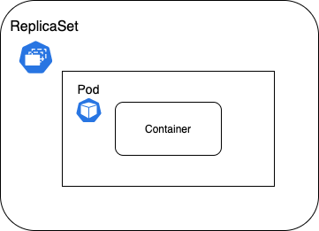

A ReplicaSet's purpose is to maintain a stable set of replica Pods running at any given time. As such, it is often used to guarantee the availability of a specified number of identical Pods.

It brings up a new instance of a Pod when the existing one crashes or fails, scales it up when the running instances are not matched to the specified number, and deletes the Pods if replicaset is scaled down.

  </p>

</details>

---

<details>
  
  <summary> 15. How does a replicaset config file look like ? </summary>
  
  <p>

```YAML
apiVersion: apps/v1
kind: ReplicaSet
metadata:
  name: my-replicaset
spec:
  selector:
    matchLabels:
      type: server # <--- replicaset selector
  replicas: 3
  template:
    metadata:
      name: my-pod
      labels:
        name: pod
        type: server # <--- pod label
    spec:
      containers:
        - name: my-container
          image: nginx
```

`ReplicaSet` selector should match the `Pod` label.

`selector` helps ReplicaSet identify what pods falls under it. Because ReplicaSet can also manage pods that were not created as part of it, say for example pods created before creating replicaset and if it matches the selector then replicaset will also take those pods into consideration when creating the replicas.

- Create a Pod

```console
kubectl apply -f ./k8s-files/replicaset/pod.yml
```

```YAML
apiVersion: v1
kind: Pod
metadata:
  labels:
    app: my-nginx
    type: web-server
  name: nginx
spec:
  containers:
    - image: nginx
      name: nginx-container
```

- Scale the previously created Pod using ReplicaSet

```console
kubectl apply -f ./k8s-files/replicaset/rs-after.yml
```

```YAML
apiVersion: apps/v1
kind: ReplicaSet
metadata:
  name: my-replicaset
spec:
  selector:
    matchLabels:
      type: web-server
  replicas: 6
  template:
    metadata:
      name: my-pod
      labels:
        name: pod
        type: web-server
    spec:
      containers:
        - name: my-container
          image: httpd
```

Output:

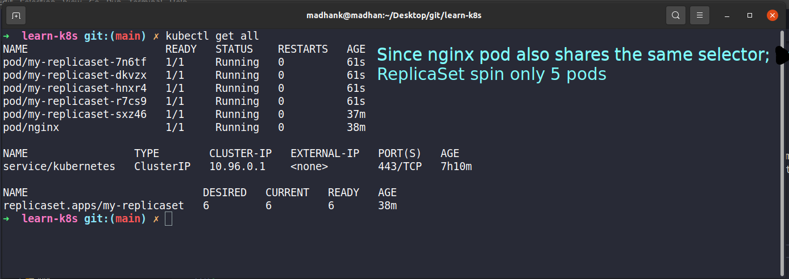

  </p>

</details>

---

<details>

  <summary> 16. How to get list of replicaset ? </summary>

  <p>

Syntax:

```console
kubectl get replicaset
```

  </p>

</details>

---

<details>

  <summary> 17. How to identify list of pods created using replicaset ? </summary>

  <p>

It will have replicaset name and container ID.

```console
kubectl get pods
```


  </p>

</details>

---

<details>

  <summary> 18. How to scale a replicaset ? </summary>

  <p>

Syntax:

```console
kubectl scale --replicas=<count> -f <file-name.yml>
kubectl scale replicaset --replicas=<count> <replicaset-name>
```

Example:

```console
kubectl scale --replicas=6 -f ./k8s-files/replicaset/replicaset.yml
```

**Note**: Scaling pods from cmd will increase the pods count to 6, but the count will not be changed in the yml file.

  </p>

</details>

---

<details>

  <summary> 19. What is usage of Labels and Selectors ? </summary>

  <p>

Labels - are key/value pairs that are attached to k8s objects, like pods, service, etc. that help to identify that object. Labels can be used to organize and to select subsets of objects.

Selectors - via a label selector, the user can identify a set of objects.

The label selector is the core grouping primitive in Kubernetes.

`Meta data` - contains labels, labels (labels do not provide uniqueness, expect many objects to carry the same label(s)) can be used to organize and to select subsets of objects.

`spec` - contains selector, selectors depend on labels to select a group of resources such as pods.

`Example template`

```YAML
apiVersion: apps/v1
kind: ReplicaSet
metadata:
  name: label-demo
  labels:
    environment: production
    app: nginx
spec:
  replicas: 3
  selector:
    matchLabels:
      app: App1
   template:
     metadata:
       labels:
         environment: production
         app: nginx
     spec:
       containers:
         - name: nginx
           image: nginx:1.7.9
```

For more details refer [here](https://kubernetes.io/docs/concepts/overview/working-with-objects/labels/)

  </p>

</details>

---

<details>

  <summary> 20. What is a Deployment in k8s ? </summary>

  <p>

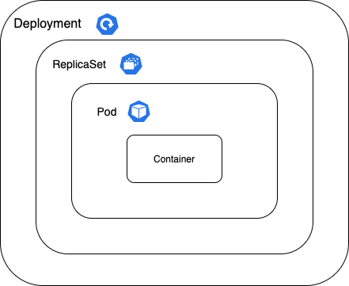

Deployment is an object in k8s, which helps in creating, modifying and managing a set of identical pods. It is a wrapper around Pods and Replicaset. It can scale the no. of pods, rollout updated code or rollback to an earlier version

  </p>

</details>

---

<details>

  <summary> 21. How to create a deployment ? </summary>

  <p>

Syntax:

```console
kubectl create deployment <deployment-name> --image=<image-name>
```

Example:

```console
kubectl create deployment my-nginx --image=nginx
```

```
Layers of abstraction -> Deployment > Replica set > Pod > Container
```

Result:


Pod name is the combination of = deployment-name + replica set ID + its own ID

  </p>

</details>

---

<details>

  <summary> 22. How does a yml file look like for Deployment ? </summary>

  <p>

Below is the nginx deployment config file

```YAML
apiVersion: apps/v1
kind: Deployment
metadata:
  labels:
    app: my-nginx
  name: my-nginx
spec:
  replicas: 3
  selector:
    matchLabels:
      app: my-nginx
  template:
    metadata:
      labels:
        app: my-nginx
    spec:
      containers:
      - image: nginx
        name: nginx
```

  </p>

</details>

---

<details>

  <summary> 23. How to view the created deployment ? </summary>

  <p>

```console
kubectl get deployments
```

  </p>

</details>

---

<details>

  <summary> 24. How to edit the deployment ? </summary>

  <p>

Syntax:

```console
kubectl edit deployment <deployment-name>
```

The above command will open up the auto-generated config file.

  </p>

</details>

---

<details>

  <summary> 25. How to delete the deployment ? </summary>

  <p>

Syntax:

```console
kubectl delete deployment <deployment-name>
```

Example:

```console
kubectl delete deployment my-nginx
kubectl delete deploy/my-nginx

```

`deploy/my-nginx` is a short form of `deployment my-nginx`

Deleting deployment will remove deployment, replicaset, pod and container. `Layers of abstraction is -> Deployment > Replica set > Pod > Container`

  </p>

</details>

---

<details>

  <summary> 26. How to create a deployment and scale it one command ? </summary>

  <p>

Syntax:

```console
kubectl create deployment <deployment-name> --image=<image-name> --replicas=<count>
```

Example:

```console
kubectl create deployment my-nginx --image=nginx --replicas=3
```

  </p>

</details>

---

<details>

  <summary> 27. How to scale an existing deployment ? </summary>

  <p>

Syntax:

```console
kubectl scale deployment <deployment-name> --replicas=<count>
```

Example:

```console
kubectl scale deploy/my-nginx --replicas=2
kubectl scale deployment my-nginx --replicas=2
```

`deploy/my-nginx` is a short form of `deployment my-nginx`

  </p>

</details>

---

<details>

  <summary> 28. How to dry run a kubernetes commands/files ? </summary>

  <p>

The main usage of dry run is used to check syntactical errors and the preview of the object that would be sent to your cluster.

Syntax:

```console
kubectl create deployment nginx --image=nginx --dry-run=client
kubectl create deployment nginx --image=nginx --dry-run=server
kubectl create deployment nginx --image=nginx --dry-run=client -o yaml # to get the result template
kubectl apply -f app.yml --dry-run
kubectl apply -f app.yml --dry-run=server
```

If `client` strategy, only print the object that would be sent, without sending it. If `server` strategy, submit server-side request without persisting the resource.

For more details refer [here](https://kubernetes.io/docs/reference/using-api/server-side-apply/)

  </p>

</details>

---

<details>

  <summary> 29. What is a namespace in k8s ? </summary>

  <p>


Here QA, UAT, and Prod are the namespaces.

**Namespaces** are Kubernetes objects which helps in organizing resources and partitions a single Kubernetes cluster into multiple virtual clusters.

By default when a cluster is created it will create 4 namespaces,

```console
kubectl get namespaces
```

1. default - by default all the resources created will be listed here.
2. kube-node-lease - namespace for the lease objects associated with each node which improves the performance of the node heartbeats as the cluster scales. It help determine the availability of a node.
3. kube-public - place for publicly accessible data.
4. kube-system - place for objects created by Kubernetes systems/control plane.

  </p>

</details>

---

<details>

  <summary> 30. How to create a namespace ? </summary>

  <p>

1. Creating namespace through CLI

Syntax:

```console
kubectl create namespace <namespace-name>
```

Example:

```console
kubectl create namespace my-namespace
```

2. Creating namespace through YAML file

```YAML
apiVersion: v1
kind: Namespace
metadata:
  name: my-namespace
```

  </p>

</details>

---

<details>

  <summary> 31. What is the need for the namespace ? </summary>

  <p>

1. Allowing resources to be grouped and isolates.
2. Avoids naming conflicts.
3. Resource sharing. (some are off limits; eg: ConfigMap in a Cluster-A, can't be accessed from Cluster-B)
4. Enhancing role-based access controls by limiting users and resources (limit usage of CPU, RAM, and Storage) to certain namespaces.

  </p>

</details>

---

<details>

  <summary> 32. Is every objects in k8s can be put under an namespace ? </summary>

  <p>

No. Namespace resources are not themselves in a namespace. And low-level resources, such as nodes and persistentVolumes, are not in any namespace.

To see which Kubernetes resources are and aren't in a namespace:

```console
# In a namespace
kubectl api-resources --namespaced=true

# Not in a namespace
kubectl api-resources --namespaced=false
```

  </p>

</details>

---

<details>

  <summary> 33. How to create a resource under a specified namespace ? </summary>

  <p>

If a namespace is not specified by default all the resources will be created under `default`.

1. From a command line

Syntax:

```console
kubectl create deployment <deployment-name> --image=<image-name> -n=<namespace-name>
kubectl create deployment <deployment-name> --image=<image-name> --namespace=<namespace-name>
```

Example:

```console
kubectl create deployment my-nginx --image=nginx -n=production
```

2.

```YAML
apiVersion: apps/v1
kind: Deployment
metadata:
  labels:
    app: my-nginx
  name: my-nginx
  namespace: production # namespace should be already created
spec:
  replicas: 1
  selector:
    matchLabels:
      app: my-nginx
  template:
    metadata:
      labels:
        app: my-nginx
    spec:
      containers:
      - image: nginx
        name: nginx
```

If you try to list all the resource by `kubectl get all` it will not display the above created resource since it lives in another namespace, to list it out, need to switch the default namespace to the newly created namespace.

  </p>

</details>

---

<details>

  <summary> 34. How to switch between namespace ? </summary>

  <p>

Syntax:

```console
kubectl config set-context --current --namespace=<namespace-name>
```

Example:

```console
kubectl config set-context --current --namespace=test-namespace
```

  </p>

</details>

---

<details>

  <summary> 35. How to view resources created specific to a namespace and for overall ? </summary>

  <p>

Syntax:

```console
kubectl get pods --namespace=<namespace-name>
kubectl get pods --all-namespaces # to get all the pods irrespective of namespaces
```

Example:

```console
kubectl get pods --namespace=prod
```

  </p>

</details>

---

<details>

  <summary> 36. How to access the resources available in other namespaces ? </summary>

  <p>

Even though namespace separates each other, adding the namespace name to the service name provides access to services in any namespace on the cluster.

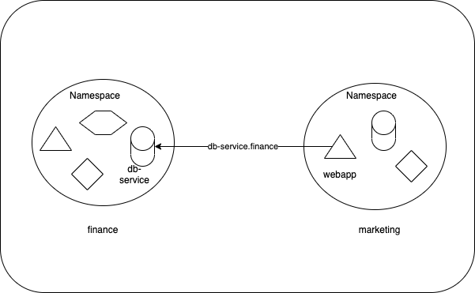

Syntax:

```console
<service-name>.<namespace-name>
<service-name>.<namespace-name>.<service>.<domain>
```

Example:

```console
db-service.finance
db-service.finance.svc.cluster.local
```

  </p>

</details>

---

<details>

  <summary> 37. How to pass the arguments and commands in k8s ? </summary>

  <p>

The command and arguments that you define in the configuration file override the default command and arguments provided by the container image.

```YAML
apiVersion: v1
kind: Pod
metadata:
  name: command-demo
  labels:
    purpose: demonstrate-command
spec:
  containers:
  - name: command-demo-container
    image: debian
    command: ["printenv"]
    args: ["HOSTNAME", "KUBERNETES_PORT"]
  restartPolicy: OnFailure
```

- Running the above config file

```console
kubectl apply -f ./k8s-files/args-and-commands/commands.yml
```

- Access the log

```console
kubectl logs command-demo
```

- Result:

```
command-demo
tcp://10.3.240.1:443
```

The command field corresponds to entrypoint in some container runtimes.

| Description                         | Docker field name | Kubernetes field name |
| ----------------------------------- | ----------------- | --------------------- |
| The command run by the container    | Entrypoint        | command               |
| The arguments passed to the command | Cmd               | args                  |

  </p>

</details>

---

<details>

  <summary> 38. How to pass a env variable in k8s ? </summary>

  <p>

Syntax:

```console
kubectl run <pod-name> --image=<image-name> --env="key=value" --env="key=value"
```

Example:

```console
kubectl run nginx --image=nginx --env="DNS_DOMAIN=cluster" --env="POD_NAMESPACE=default"
```

YAML config file.

```YAML
apiVersion: v1
kind: Pod
metadata:
  labels:
    run: nginx
  name: nginx
spec:
  containers:
  - env:
    - name: DNS_DOMAIN
      value: cluster
    - name: POD_NAMESPACE
      value: default
    image: nginx
    name: nginx
  dnsPolicy: ClusterFirst
  restartPolicy: Always
```

  </p>

</details>

---

<details>

  <summary> 39. How to easily manage non-confidential key-value details ? What is the use of ConfigMaps ? </summary>

  <p>

A ConfigMap is an API object used to store non-confidential data in key-value pairs. Pods can consume ConfigMaps as environment variables, command-line arguments, or as configuration files in a volume. It allows you to decouple environment-specific configuration from your container images, so that your applications are easily portable.

So it does not provide any secrecy or encryption, so its not suitable for storing passwords or keys.

  </p>

</details>

---

<details>

  <summary> 40. How to create a configmap ? </summary>

  <p>

1. Imperative way of creating a configmap

   a. Creating a ConfigMap from individual key-value pairs

   Syntax:

   ```console
   kubectl create configmap \
       <config-name> --from-literal=<key>=<value>
   ```

   Example:

   ```console
   kubectl create configmap \
       app-config --from-literal=APP_COLOR=blue \
                  --from-literal=APP_LOG_LEVEL=verbose
   ```

   b. Creating a config map from a file

   Syntax:

   ```console
   kubectl create configmap \
       <config-name> --from-file=<path-to-file>
   ```

   Example:

   ```console
   kubectl create configmap \
       app-config --from-file=k8s-files/ex-4-configmaps/configfile.properties
   ```

   c. Creating a config map from a env file

   Syntax:

   ```console
   kubectl create configmap \
       <config-name> --from-env-file=<path-to-file>
   ```

   Example:

   ```console
   kubectl create configmap \
       app-config --from-env-file=k8s-files/ex-4-configmaps/configfile.properties
   ```

2. Declarative way of creating a configmap

```YAML
apiVersion: v1
kind: ConfigMap
metadata:
  name: app-config
data:
  APP_COLOR: blue
  APP_LOG_LEVEL: verbose
```

  </p>

</details>

---

<details>

  <summary> 41. How to utilize the ConfigMaps with an example ? </summary>

  <p>

Example `Configmap`:

```YAML
kind: ConfigMap
apiVersion: v1
metadata:
  name: test-configmap
data:
  # Configuration Values are stored as key-value pairs
  env.data.name: "test-app"
  env.data.url: "https://test-app.com"
  # File like Keys
  log.properties: |
    log_level=2
    error.color=red
    info.color2=green
```

1.  Configuring all key-value pairs in a ConfigMap as container environment variables

```YAML
apiVersion: v1
kind: Pod
metadata:
  name: configmap-pod
spec:
  containers:
    - name: configmap-busybox
      image: k8s.gcr.io/busybox
      command: [ "/bin/sh", "-c", "env" ]
      envFrom: # it is used to load all configMap key-value pairs as environment variables
        # Loading the Complete ConfigMap
        - configMapRef:
            name: test-configmap # env variable will be set as
  restartPolicy: Never
```

Access the log to see the env values

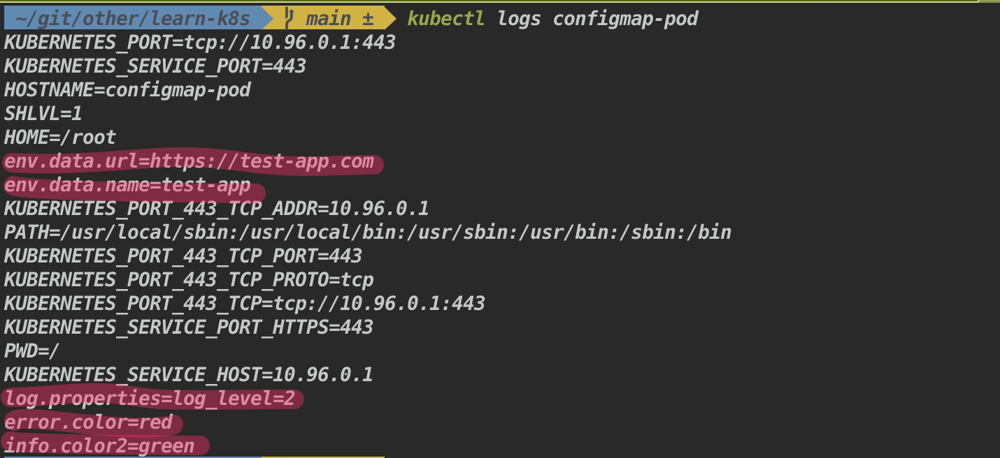

2.  Configuring a subset of key-value pairs in a ConfigMap as container environment variables

```YAML
apiVersion: v1
kind: Pod
metadata:
  name: configmap-pod
spec:
  restartPolicy: Never
  containers:
    - name: configmap-busybox
      image: k8s.gcr.io/busybox
      command: [ "/bin/sh", "-c", "env" ]
      env:
        - name: SPECIAL_LEVEL_KEY # env variable name
          valueFrom:
            configMapKeyRef:
              name: test-configmap # referring to the ConfigMap name
              key: env.data.url # referring to ConfigMap key where the key is associated with the value
```

Access the log to see the env values

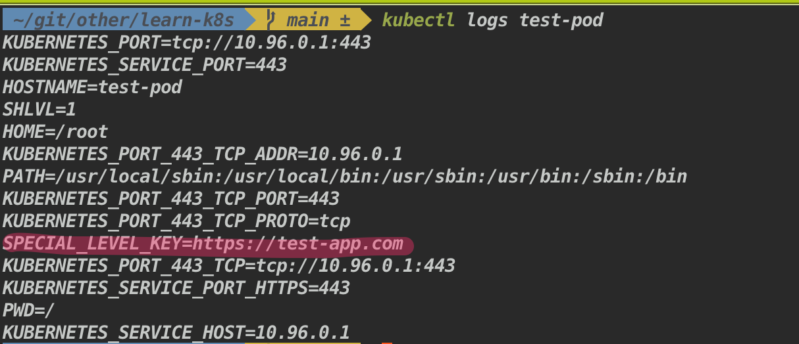

3.  Using ConfigMaps as a volumes

```YAML
apiVersion: v1
kind: Pod
metadata:
  name: configmap-pod
spec:
  containers:
    - name: test-container
      image: k8s.gcr.io/busybox
      command: ["/bin/sh", "-c", "echo $(cd config/ && ls)"]
      volumeMounts:
        - name: config
          mountPath: "/config"
          readOnly: true
  volumes:
    - name: config
      configMap:
        name: test-configmap
  restartPolicy: Never
```

Access the log to see the each key is converted to a file

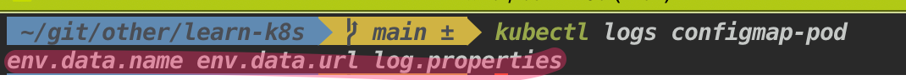

  </p>

</details>

---

<details>

  <summary> 42. How to easily manage secrets in k8s ? What is the use of Secrets ? </summary>

  <p>
  
  **Secrets** let you store and manage sensitive information, such as passwords, OAuth tokens, and ssh keys.

It can be used in 3 ways,

- As files in a volume mounted on one or more of its containers.
- As container environment variable.
- By the kubelet when pulling images for the Pod.

**Note**: Secrets are encoded data in base64 format. Anyone with the base64 encoded secret can easily decode it.

Better ways of handling sensitive data like passwords in Kubernetes, such as using tools like

- [Helm Secrets](https://github.com/jkroepke/helm-secrets/wiki/Usage)
- [HashiCorp Vault](https://www.vaultproject.io/)

  </p>

</details>
  
---

<details>

  <summary> 43. What are the ways we can store data in secrets ? </summary>

  <p>
  
  There are two ways we can store data in secrets,
  1. base64 encoded 
  2. plain text - k8s will automatically encode

  </p>

</details>

---

<details>

  <summary> 44. How to create a secrets ? </summary>

  <p>

1. Imperative way of creating a secret

   1. Creating a secret map from a literal

   Syntax:

   ```console
   kubectl create secret generic \
       <secret-name> --from-literal=<key>=<value>
   ```

   Example:

   ```console
   kubectl create secret generic \
       app-secret --from-literal=DB_USER=root \
                  --from-literal=DB_PASSWORD=admin
   ```

   2. Creating a secret map from a file

   Syntax:

   ```console
   kubectl create secret generic \
       <secret-name> --from-file=<path-to-file>
   ```

   Example:

   ```console
   kubectl create secret generic \
       app-secret --from-file=k8s-files/ex-4-configmaps/configfile.properties
   ```

2. Declarative way of creating a configmap

Convert the plain text password into base64 encoded string

```console
echo -n "password" | base64
```

Convert the base64 encoded string to plain text

```console
echo `echo -n "cGFzc3dvcmQ=" | base64 --decode`
```

```YAML
apiVersion: v1
kind: Secret
metadata:
    name: test-secret
type: Opaque
data:
    username: dXNlcm5hbWU=
    password: cGFzc3dvcmQ=
```

2.  Plain text

```YAML
apiVersion: v1
kind: Secret
metadata:
  name: test-secret2
type: Opaque
stringData:
  username: admin
  password: admin
```

  </p>

</details>

---

<details>

  <summary> 45. How to use secrets with an example ?   </summary>

  <p>

1.  Utilizing as file

```YAML
apiVersion: v1
kind: Pod
metadata:
  name: mysql-client
spec:
  containers:
  - name: mysql
	image: mysql
	command: ["/bin/sh"]
	args: ["-c","mysql -u `cat /mnt/db-creds/user)` -p`cat /mnt/db-creds/password)` -h `cat /mnt/db-creds/host)`"]
	volumeMounts:
	- name: creds
  	  mountPath: "/mnt/db-creds"
  	  readOnly: true
  volumes:
  - name: creds
    secret:
  	secretName: test-secret
```

2.  using it through env variables

```YAML
apiVersion: apps/v1
kind: Deployment
metadata:
  name: mongodb-deployment
  labels:
    app: mongodb
spec:
  replicas: 1
  selector:
    matchLabels:
      app: mongodb
  template:
    metadata:
      labels:
        app: mongodb
    spec:
      containers:
      - name: mongodb
        image: mongo
        ports:
        - containerPort: 27017
        env:
        - name: MONGO_INITDB_ROOT_USERNAME
          valueFrom:
            secretKeyRef:
              name: test-secret2
              key: username
        - name: MONGO_INITDB_ROOT_PASSWORD
          valueFrom:
            secretKeyRef:
              name: test-secret2
              key: password
```

3. Using it as a multiple env variables

```YAML
apiVersion: v1
kind: Pod
metadata:
    name: configmap-pod
spec:
    containers:
    - name: configmap-busybox
        image: k8s.gcr.io/busybox
        command: [ "/bin/sh", "-c", "env" ]
        envFrom:
        # Loading the Complete secret
        - secretRef:
            name: test-configmap
    restartPolicy: Never
```

  </p>

</details>

---

<details>

  <summary> 46. How to run PODS as a specific user and add capabilities ? </summary>

  <p>
  
1. Specific user at container level

```YAML
apiVersion: v1
kind: Pod
metadata:
  name: web-pod
spec:
  containers:
  - image: ubuntu
    name: ubuntu
    command: ["sleep", "3600"]
    securityContext:
        runAsUser: 1000
        capabilities: ["MAC_ADMIN"]
  restartPolicy: Never
```

2. Specific user at pods level (if an is user specified at pod level, all the container in the pod will be run as that user)

```YAML
apiVersion: v1
kind: Pod
metadata:
  name: web-pod
spec:
  securityContext:
    runAsUser: 1000
  containers:
  - image: ubuntu
    name: ubuntu
    command: ["sleep", "3600"]
  - image: busybox
    name: busybox
    securityContext:
        runAsUser: 2000 # overriding the pod level user
        capabilities: ["MAC_ADMIN"]
  restartPolicy: Never
```

  </p>

</details>

---

<details>

  <summary> 47. What is Service Accounts in k8s ? </summary>

  <p>

There 2 types of account in k8s,

1.  User account - is used by humans, authenticated by the apiserver, performing some administrative tasks (for example, using kubectl) or a developer accessing the cluster to deploy an applications
2.  Service account - processes in containers inside pods can also contact the apiserver

  </p>

</details>

---

<details>

  <summary> 48. How to create a service account ? </summary>

  <p>

Syntax:

```console
kubectl create serviceaccount <service-account-name>
```

Example:

```console
kubectl create serviceaccount custom-dashboard
```

To get the list of service accounts

```console
kubectl get serviceaccount
```

  </p>

</details>

---

<details>

  <summary> 49. What is resource ? And how does a resource allocation takes place in k8s ? </summary>

  <p>

When a pod is created, optionally each resources needed for a container can be specified. The most common resources are 1. CPU and 2. Memory (RAM).

When a container is specified with the resource `request`, scheduler uses these information to decide on which node to place the pod. When a container is specified with the resource `limit`, kubelet enforces the container to use only the allowed limit.

If the node has not sufficient resources to place a pod then scheduler avoids that node and instead places that pod in the node which has the resources available.

If all the nodes available in the cluster does not have sufficient resources, k8s holds scheduling the pods and it will be in the pending state.

  </p>

</details>

---

<details>

  <summary> 50. What is the difference between `Request` and `Limit` ? </summary>

  <p>

It's possible (and allowed) for a container to use more resource than its `request` for that resource specifies. However, a container is not allowed to use more than its resource `limit`.

If a pod tries to exceed a resource beyond it's limit, incase of CPU k8s throttles it and incase of RAM it terminates the pod.

  </p>

</details>

---

<details>

  <summary> 51. How to specify the resource request and limit ? </summary>

  <p>

```YAML
apiVersion: v1
kind: Pod
metadata:
  name: frontend
spec:
  containers:
  - name: app
    image: images.my-company.example/app:v4
    resources:
      requests:
        memory: "64Mi"
        cpu: "250m"
      limits:
        memory: "128Mi"
        cpu: "500m"
  - name: log-aggregator
    image: images.my-company.example/log-aggregator:v6
    resources:
      requests:
        memory: "64Mi"
        cpu: "250m"
      limits:
        memory: "128Mi"
        cpu: "500m"
```

1 G (Gigabyte) = 1,000,000,000 bytes
1 M (Megabyte) = 1,000,000 bytes
1 K (kilobyte) = 1,000 bytes

1 Gi (Gibibyte) = 1,073,741,824 bytes
1 Mi (Mebibyte) = 1,048,576 bytes
1 Ki (kibibyte) = 1,024 bytes

  </p>

</details>

---

<details>

  <summary> 52. What is mean by taints and toleration ? </summary>

  <p>

`Taints` and `Tolerations` allow the node to control which pods should or should not be places on it. A taint allows a node to refuse pod to be scheduled unless that pod has a matching toleration.

You apply taints to a node through the node specification (NodeSpec) and apply tolerations to a pod through the pod specification (PodSpec). A taint on a node instructs the node to repel all pods that do not tolerate the taint.

Taints and tolerations are only meant to restrict node from accepting certain pods but it does not guarantee that a pod with tolerations is always placed on a tainted node.

  </p>

</details>

---

<details>

  <summary> 53. How to add a taints and tolerations ? </summary>

  <p>

1. Adding taints to the node

Syntax:

```console
kubectl taint nodes node1 key1=value1:taint-effect
```

There are 3 types of taint effect,

- NoSchedule - part will not be scheduled on the nodes
- PreferNoSchedule - system will try to avoid placing the pod in the node but not guaranteed
- NoExecute - new pods will not be placed on the node and existing pods will be evicted if they don't tolerate taint

Example:

```
kubectl taint nodes node1 app=blue:NoSchedule
```

Note: If you are using minikube, follow this guide to setup multi node (https://minikube.sigs.k8s.io/docs/tutorials/multi_node/)

2. Adding tolerations to the pod

```YAML
apiVersion: v1
kind: Pod
metadata:
  name: nginx
  labels:
    env: test
spec:
  containers:
  - name: nginx
    image: nginx
    imagePullPolicy: IfNotPresent
  tolerations:
  - key: "app"
    operator: "Equal"
    value: "blue"
    effect: "NoSchedule"
```

For more info refer [here](https://kubernetes.io/docs/concepts/scheduling-eviction/taint-and-toleration/)

  </p>

</details>

---

<details>

  <summary> 54. How to remove the taint from the node ? </summary>

  <p>

To remove the added taints from the node add `minus` symbol in the end

Syntax:

```console
kubectl taint nodes node1 key1=value1:NoSchedule-
```

Example:

```console
kubectl taint nodes node1 app=blue:NoSchedule-
```

  </p>

</details>

---

<details>

  <summary> 55. How to assign pods to a specific node ? </summary>

  <p>

We can add a constraints at a Pod level so that it will run only on a particular set of Node(s). The recommended approach is to add `label` to the node and `nodeSelectors` to the pod for facilitate the selection.

  </p>

</details>

---

<details>

  <summary> 56. How to add a label to the node ? </summary>

  <p>

Syntax:

```console
kubectl label nodes <node-name> <label-key>=<label-value>
```

Example:

```console
kubectl label nodes node01 size=large
```

  </p>

</details>

---

<details>

  <summary> 57. How to select a specific node for placing a pod ? </summary>

  <p>

Select a specific node by using `nodeSelector`

```YAML
apiVersion: v1
kind: Pod
metadata:
  name: nginx
  labels:
    env: test
spec:
  containers:
  - name: nginx
    image: nginx
  nodeSelector:
    size: large
```

  </p>

</details>

---

<details>

  <summary> 58. What is the limitations of using `nodeSelector` ? And how to overcome it ? </summary>

  <p>

Following logical expression type of selection cannot be achieved using `nodeSelector`, for this one has to go for `Node affinity`.

- size: Large or Medium
- size: Not Small

  </p>

</details>

---

<details>

  <summary> 59. What is node affinity ? </summary>

  <p>
  
It allows you to constrain which nodes your pod is eligible to be scheduled on, based on labels on the node. And it allows the constraint more expressive.

Available types:

- Hard type : requiredDuringSchedulingIgnoredDuringExecution (if node didn't match pod will not be placed)
- Soft type : preferredDuringSchedulingIgnoredDuringExecution (even if node didn't match pod will be placed in anyone of the node)

```YAML
apiVersion: v1
kind: Pod
metadata:
  name: myapp-pod
  labels:
    env: staging
spec:
  containers:
    - name: node-affinity
      image: nginx
  affinity:
    nodeAffinity:
      requiredDuringSchedulingIgnoredDuringExecution:
        nodeSelectorTerms:
          - matchExpressions:
              - key: size
                operator: In
                values:
                  - Large
                  - Medium
```

  </p>

</details>

---

<details>

  <summary> 60. What is the purpose of the multi container pods ? </summary>

  <p>

- The main purpose of a multi-container Pod is to facilitate support co-located, co-managed helper processes for a primary application. For example, providing logging service to the web server.
- Multi containers in a pod share same network namespace, shared volumes, and the same IPC namespace so it possible for these containers to efficiently communicate, ensuring data locality.
- This allows to manage several tightly coupled application containers as a single unit.
- All the containers in the pod share same lifecycle.

  </p>

</details>

---

<details>

  <summary> 61. What are some of the design patterns for Multi container pods ? </summary>

  <p>

//TODO: Need to add examples for below design pattern with diagrams and explanation

1. **Sidecar pattern**

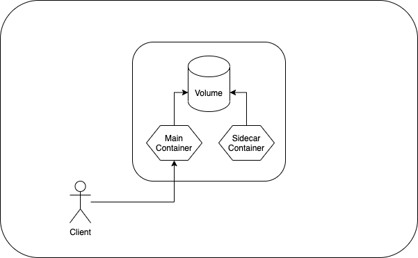

A Sidecar container is a second container added to the Pod definition. It is placed in the same Pod so that it can use the same resources being used by the main container.

```YAML
apiVersion: v1
kind: Pod
metadata:
  name: webserver
spec:
  volumes:
    - name: shared-logs
      emptyDir: {}
  containers:
    - name: nginx
      image: nginx
      volumeMounts:
        - name: shared-logs
          mountPath: /var/log/nginx
    - name: sidecar-container
      image: busybox
      command:
        [
          "sh",
          "-c",
          "while true; do cat /var/log/nginx/access.log /var/log/nginx/error.log; sleep 30; done",
        ]
      volumeMounts:
        - name: shared-logs
          mountPath: /var/log/nginx
```

And access the log by executing the following command

```console
kubectl exec webserver -c sidecar-container -- bin/cat /var/log/nginx/error.log
kubectl exec webserver -c sidecar-container -- bin/cat /var/log/nginx/access.log
```

For more information refer following article,

[1] [Sidecar pattern](https://www.magalix.com/blog/the-sidecar-pattern)

2. **Adapter design pattern**
3. **Ambassador design pattern**

  </p>

</details>

---

<details>

  <summary> 62. How does multi container pod communication happens ? </summary>

  <p>

There are three ways that containers in the pod communicate with each other.

1. Shared volumes,
2. Inter-process communications (IPC), and
3. Inter-container network communication.

For more information refer following article,

[1] [Multi-container pods and container communication](https://www.mirantis.com/blog/multi-container-pods-and-container-communication-in-kubernetes/)

  </p>

</details>

---

<details>

  <summary> 63. How to maintain the order of container creation in terms of multi-container pods ?  </summary>

  <p>

Init containers can be use to maintain the order of the execution. Containers specified in the initContainers section will run before starting main container in the pod. Init container executes sequentially and each of the init containers must succeed before the next can run.

```YAML
apiVersion: v1
kind: Pod
metadata:
  name: myapp-pod
  labels:
    app: myapp
spec:
  containers:
    - name: myapp-container
      image: busybox:1.28
      command: ["sh", "-c", "echo The app is running! && sleep 3600"]
  initContainers:
    - name: init-myservice
      image: busybox:1.28
      command:
        [
          "sh",
          "-c",
          "until nslookup myservice.$(cat /var/run/secrets/kubernetes.io/serviceaccount/namespace).svc.cluster.local; do echo waiting for myservice; sleep 2; done",
        ]
    - name: init-mydb
      image: busybox:1.28
      command:
        [
          "sh",
          "-c",
          "until nslookup mydb.$(cat /var/run/secrets/kubernetes.io/serviceaccount/namespace).svc.cluster.local; do echo waiting for mydb; sleep 2; done",
        ]
```

This example defines a simple Pod that has two init containers. The first waits for myservice, and the second waits for mydb. Once both init containers complete, the Pod runs the app container from its spec section.

  </p>

</details>

---

<details>

  <summary> 64. What are the pod status ? </summary>

  <p>

| Value     | Description                                                                                                                                                                                                                                                        |
| --------- | ------------------------------------------------------------------------------------------------------------------------------------------------------------------------------------------------------------------------------------------------------------------ |
| Pending   | The Pod has been accepted by the Kubernetes cluster, but one or more of the containers has not been set up and made ready to run. This includes time a Pod spends waiting to be scheduled as well as the time spent downloading container images over the network. |
| Running   | The Pod has been bound to a node, and all of the containers have been created. At least one container is still running, or is in the process of starting or restarting.                                                                                            |
| Succeeded | All containers in the Pod have terminated in success, and will not be restarted.                                                                                                                                                                                   |
| Failed    | All containers in the Pod have terminated, and at least one container has terminated in failure. That is, the container either exited with non-zero status or was terminated by the system.                                                                        |
| Unknown   | For some reason the state of the Pod could not be obtained. This phase typically occurs due to an error in communicating with the node where the Pod should be running.                                                                                            |

  </p>

</details>

---

<details>

  <summary> 65. What are the pod conditions ? </summary>

  <p>
  
A Pod has a PodStatus, which has an array of PodConditions through which the Pod has or has not passed:

`PodScheduled`: the Pod has been scheduled to a node.

`ContainersReady`: all containers in the Pod are ready.

`Initialized`: all init containers have started successfully.

`Ready`: the Pod is able to serve requests and should be added to the load balancing pools of all matching Services.

  </p>

</details>

---

<details>

  <summary> 66. What are the types of health checks available in k8s ? </summary>

  <p>
<div style="text-align: center;">
    
</div>

Image source - [Google cloud blog](https://cloud.google.com/blog/products/containers-kubernetes/kubernetes-best-practices-setting-up-health-checks-with-readiness-and-liveness-probes)

1. **Liveness probes** - allows to check if app is alive. The kubelet agent that runs on each node uses the liveness probes to ensure that the containers are running as expected. Many applications running for long periods of time eventually transition to broken states, and cannot recover except by being restarted. Kubernetes provides liveness probes to detect and remedy such situations.

<div style="text-align: center;">
    
</div>

2. **Readiness probes** - The kubelet uses readiness probes to know when a container is ready to start accepting traffic. A Pod is considered ready when all of its containers are ready. If a readiness probe fails, Kubernetes will stop routing traffic to the pod until the probe passes again.

3. **Startup probes** - It is used to determine whether the container has started. If such a probe is configured, it disables liveness and readiness checks until it succeeds, making sure those probes don't interfere with the application startup. This can be used to adopt liveness checks on slow starting containers, avoiding them getting killed by the kubelet before they are up and running.

  </p>

</details>

---

<details>

  <summary> 67. How to perform different types of health checks ? </summary>

  <p>

At some point, an application may crash. Or an application might be still in the initialization stage and not yet ready to receive and process requests. Using probes (testing), we can determine whether the container is crashed or still running.

There is 3 ways to do it.

1. Sending an HTTP request
2. Running a command
3. Opening a TCP socket

---

1. Checking liveness and start-up probes using HTTP request

```YAML
apiVersion: v1
kind: Pod
metadata:
  labels:
    test: liveness
  name: liveness-http
spec:
  containers:
    - name: liveness
      image: k8s.gcr.io/liveness
      args:
        - /server
      livenessProbe:
        httpGet:
          path: /healthz
          port: 8080
          httpHeaders:
            - name: Custom-Header
              value: Awesome
        initialDelaySeconds: 3
        periodSeconds: 3
      startupProbe:
        httpGet:
          path: /healthz
          port: 8080
        failureThreshold: 30
        periodSeconds: 10
```

`livenessProbe` For the first 10 seconds that the container is alive, the /healthz handler returns a status of 200. After that, the handler returns a status of 500. The kubelet starts performing health checks 3 seconds after the container starts. So the first couple of health checks will succeed. But after 10 seconds, the health checks will fail, and the kubelet will kill and restart the container.

`startupProbes` legacy applications that might require an additional startup time on their first initialization. In such cases, it can be tricky to set up liveness probe parameters without compromising the fast response to deadlocks that motivated such a probe. setting up a startup probe with the same command, HTTP or TCP check, with a failureThreshold _ periodSeconds long enough to cover the worse case startup time. The application will have a maximum of 5 minutes (30 _ 10 = 300s) to finish its startup. Once the startup probe has succeeded once, the liveness probe takes over to provide a fast response to container deadlocks. If the startup probe never succeeds, the container is killed after 300s and subject to the pod's restartPolicy

Complete [source code](https://github.com/kubernetes/kubernetes/blob/master/test/images/agnhost/liveness/server.go)

```go
http.HandleFunc("/healthz", func(w http.ResponseWriter, r *http.Request) {
    duration := time.Now().Sub(started)
    if duration.Seconds() > 10 { // <-- After 10 secs it throws an error, kubelet will kill and restart the container.
        w.WriteHeader(500)
        w.Write([]byte(fmt.Sprintf("error: %v", duration.Seconds())))
    } else {
        w.WriteHeader(200)
        w.Write([]byte("ok"))
    }
})
```

2. Checking liveness and readiness probe using TCP request

```YAML
apiVersion: v1
kind: Pod
metadata:
  name: goproxy
  labels:
    app: goproxy
spec:
  containers:
    - name: goproxy
      image: k8s.gcr.io/goproxy:0.1
      ports:
        - containerPort: 8080
      readinessProbe:
        tcpSocket:
          port: 8080
        initialDelaySeconds: 5
        periodSeconds: 10
      livenessProbe:
        tcpSocket:
          port: 8080
        initialDelaySeconds: 15
        periodSeconds: 20
```

This example uses both readiness and liveness probes. The kubelet will send the first readiness probe 5 seconds after the container starts. This will attempt to connect to the goproxy container on port 8080. If the probe succeeds, the Pod will be marked as ready. The kubelet will continue to run this check every 10 seconds.

In addition to the readiness probe, this configuration includes a liveness probe. The kubelet will run the first liveness probe 15 seconds after the container starts. Similar to the readiness probe, this will attempt to connect to the goproxy container on port 8080. If the liveness probe fails, the container will be restarted.

3. Checking liveness using command

```YAML
apiVersion: v1
kind: Pod
metadata:
  labels:
    test: liveness
  name: liveness-exec
spec:
  containers:
    - name: liveness
      image: k8s.gcr.io/busybox
      args:
        - /bin/sh
        - -c
        - touch /tmp/healthy; sleep 30; rm -rf /tmp/healthy; sleep 600
      livenessProbe:
        exec:
          command:
            - cat
            - /tmp/healthy
        initialDelaySeconds: 5
        periodSeconds: 5
```

For the first 30 seconds of the container's life, there is a /tmp/healthy file. So during the first 30 seconds, the command cat /tmp/healthy returns a success code. After 30 seconds, cat /tmp/healthy returns a failure code. So the containers have been killed and recreated.

  </p>

</details>

---

<details>

  <summary> 68. How to view the logs for multi container pods ? </summary>

  <p>

```YAML
apiVersion: v1
kind: Pod
metadata:
  name: webserver
spec:
  containers:
    - name: container-1
      image: nginx
    - name: container-2
      image: busybox
```

If the pod has multi containers

Syntax:

```console
kubectl logs -f <pod-name> <container-name>
```

Example:

```console
kubectl logs -f webserver container-1
```

  </p>

</details>

---

<details>

  <summary> 69. How to view the performance metrics of node and pod in k8s ? </summary>

  <p>
  
If you are using minikube enable the metrics-server addons

```console
minikube enable addons metrics-server
```

To view performance metric of node:

```console
kubectl top node
```

To view performance metric of pod:

```console
kubectl top pod
```

  </p>

</details>

---

<details>

  <summary> 70. What is rolling and rollback deployment ? </summary>

  <p>

1. **Rolling deployment** - It is a software release strategy, which usually (one by one / one or more) replaces pods of the previous version of the application with pods of the newer version without any downtime. It is the default deployment strategy in k8s.

<div style="text-align: center;">
    
</div>

Image courtesy - [Bluematador](https://www.bluematador.com/blog/kubernetes-deployments-rolling-update-configuration)

```YAML
replicas: 3
strategy:
  type: RollingUpdate # <-- This is the default deployment strategy in k8s
  rollingUpdate:
    maxSurge: 1 # specifies maximum number of Pods that can be created over the desired number of Pods during the update.
    maxUnavailable: 0 # specifies the maximum number of Pods that can be unavailable during the update process.
```

`maxSurge` and `maxUnavailable` values can be in **percentage** or **absolute number**.

For example, If you were using the default values of 25% for both `maxSurge` and `maxUnavailable`, and applied an update to a `Deployment` with `8 pods`, then maxSurge would be 2 pods, and maxUnavailable would also be 2 pods. That means that during the update process, the following conditions will be met:

- At most 10 pods (8 desired pods + 2 maxSurge pods) will be Ready during the update
- At least 6 pods (8 desired pods - 2 maxUnavailable pods) will always be Ready during the update

2. **Rollback deployment** - It means going back to the previous instance of the deployment if there is some issue with the current deployment.

```console
# rollback to previous version
kubectl rollout undo deployment <deployment-name>
kubectl rollout undo -f <file.deployment.yaml>
kubectl rollout undo deployment <deployment-name> --to-revision=<revision-number>

# to check the status of the deployment
kubectl rollout status deployment <deployment-name>
kubectl rollout status -f <file.deployment.yaml>

# to view the history of the deployment
kubectl rollout history deployment <deployment-name>
kubectl rollout history -f <file.deployment.yaml>
kubectl rollout history deployment <deployment-name> --revision=<revision-number>
```

  </p>

</details>

---

<details>

<summary> 71. What are the different strategies for deployment ? </summary>

<p>

1. Canary deployment:


Image courtesy - [newstack](https://thenewstack.io/deployment-strategies/)

It is a deployment strategy that is used to test the availability of a new version of the application by rollin out a new deployment but only route a small percentage of traffic to the new version.

2. Blue-green deployment:


Image courtesy - [RedHat](https://www.redhat.com/en/topics/devops/what-is-blue-green-deployment)

It is a deployment strategy that is used to test the availability of a new version by releasing Version B (green environment) alongside version A (blue environment), then the traffic is switched to version B. The old version can be called the blue environment while the new version can be known as the green environment.

</p>

</details>

---

<details>

  <summary> 71. Demonstration of rolling and rollback deployment with an example ? </summary>

  <p>

1. Create a deployment

```console
kubectl apply -f ./k8s-files/rolling-update/rolling-update.yml --record
```

2. Check the rollout status

Syntax:

```console
kubectl rollout status deployment <deployment-name>
```

Example:

```console
kubectl rollout status deployment nginx-deployment
```

Result:

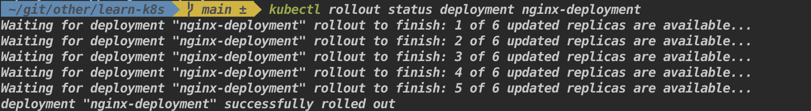

3. Check the rollout history

Syntax:

```console
kubectl rollout history deployment <deployment-name>
```

Example:

```console
kubectl rollout history deploy nginx-deployment
```

Result:

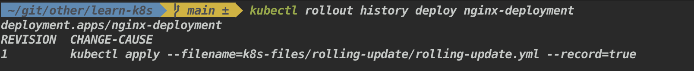

4. Check the version of the nginx image

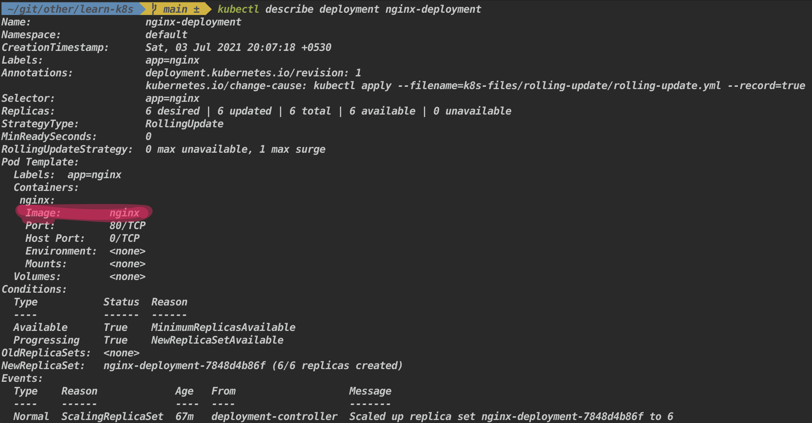

5.  Set the nginx image to a specific version

Syntax:

```console
kubectl set image deployment <deployment-name> <container-name>=<image-version>
```

Example:

```console
kubectl set image deployment nginx-deployment nginx=nginx:1.19-alpine
```

6. Check the version of the nginx image

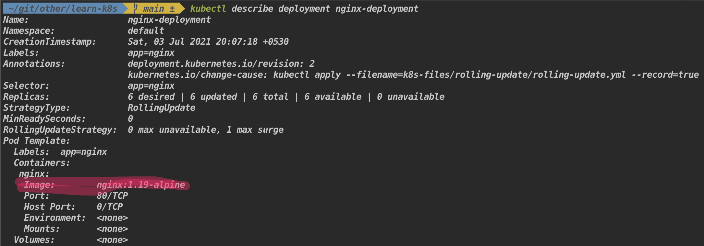

7. Rollback the deployment

Syntax:

```console
kubectl rollout undo deployment <deployment-name>
kubectl rollout undo deployment <deployment-name> --to-revision=<revision-number> # If --to-revision flag is not specified, kubectl picks the most recent revision.
```

Example:

```console
kubectl rollout undo deployment nginx-deployment
```

8. Check the version of the nginx image

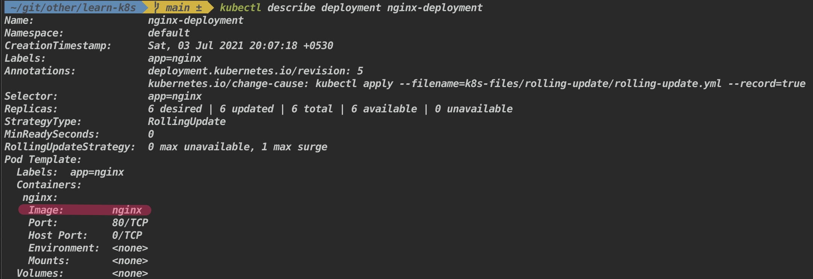

The nginx version is back to latest.

**Note** - For more such deployment strategy [refer](https://github.com/ContainerSolutions/k8s-deployment-strategies)

</p>

</details>

---

<details>

  <summary> 72. What is Jobs and the uses of it ? </summary>

  <p>

Job used to run a finite task. It will create one or more Pods and performs a given task. Once the task is completed successfully, pod will be exited. Jobs are useful for large computation and batch-oriented tasks. It supports parallel execution of Pods.

A Job should not restart a pod when it has been terminated successfully. Either `Never` or `OnFailure` should be used in the `restartPolicy`.

  </p>

</details>

---

<details>

  <summary> 73. How to create a Job in k8s ? </summary>

  <p>

- Create a Job using imperative command

Synatx:

```console
kubectl create job <job-name> --image=<imgage-name>
```

Exmaple:

```console
kubectl create job throw-dice-job --image=kodekloud/throw-dice
```

- Create a Job using declarative command

```YAML
apiVersion: batch/v1
kind: Job
metadata:
  name: math-add-job
spec:
  template:
    spec:
      containers:
        - name: math-add
          image: ubuntu
          command: ["expr", "3", "+", "2"]
      restartPolicy: OnFailure
  backoffLimit: 4
```

1. Create a Job to perform a computation task

```console
kubectl apply -f k8s-files/jobs/jobs.yml
```

2. View the pod status

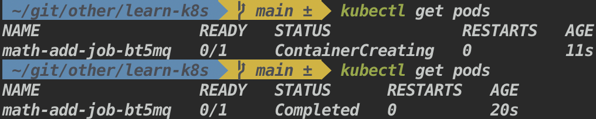

3. To view the results of the computation

```
kubectl logs <pod-name>
kubectl logs math-add-job-bt5mq
```

  </p>

</details>

---

<details>

  <summary> 74. How to run multiple jobs and as well as in parallel ? </summary>

  <p>

1. Running multiple jobs

It runs the jobs in sequential order, once when a current task in a pod completed successfully it will move on to creating the next pod.

```YAML
apiVersion: batch/v1
kind: Job
metadata:
  name: math-add-job
spec:
  completions: 3 # <---- Specifies the desired number of successfully finished pods the job should be run with.
  template:
    spec:
      containers:
        - name: math-add
          image: ubuntu
          command: ["expr", "3", "+", "2"]
      restartPolicy: OnFailure
  backoffLimit: 4
```

Above Job creates the first pod, when the pod terminated without failure, Job will spin the next one all long till the last of the ten pods were created and terminated with no failure.

2. Running multiple jobs in parallel

```YAML
apiVersion: batch/v1
kind: Job
metadata:
  name: math-add-job
spec:
  parallelism: 3 # <---- Specifies the maximum desired number of pods the job should run at any given time.
  completions: 3
  template:
    spec:
      containers:
        - name: math-add
          image: ubuntu
          command: ["expr", "3", "+", "2"]
      restartPolicy: OnFailure
  backoffLimit: 4
```

Instead of running the jobs one after another, parallelism enables the feature of running them in parallel.

  </p>

</details>

---

<details>

<summary> 75. What is a CronJob ? </summary>

<p>

A CronJob creates Jobs on a repeating schedule. It runs a job periodically on a given schedule, written in Cron format. It is useful for creating periodic and recurring tasks, like running backups or sending emails.

CronJobs names should be less than 52 characters this is because CronJob controller automatically adds some characters to the job name.

</p>

</details>

---

<details>

<summary> 76. What is the format for CronJob ? </summary>

<p>

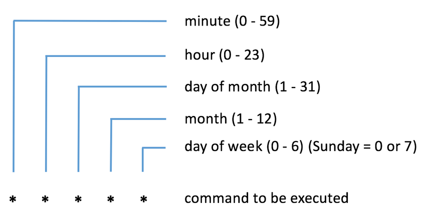

Examples:

`30 22 * * 1` - Run at 22:30 every Monday.

Additional formats:

`0 * * * *` - `@hourly` - Run once every hour.

`0 0 * * *` - `@daily` - Run once every day at midnight

</p>

</details>

---

<details>

  <summary> 75. How to create a CronJob ? </summary>

  <p>

1. Create cronjob

```YAML
apiVersion: batch/v1beta1
kind: CronJob
metadata:
  name: cronjob-demo
spec:
  schedule: "*/1 * * * *"
  jobTemplate:
    spec:
      completions: 3
      parallelism: 3
      template:
        spec:
          containers:
            - name: hello
              image: bash
              command: ["echo", "Hello world"]
          restartPolicy: OnFailure
```

2. View created cronjob

```console
kubectl get cronjob
```

3. View the logs of the pod

```console
kubectl logs cronjob-demo-1625673540-fdndx
```

Result:

```
Hello world
```

The above cronjob will run one job every 5 minutes and prints “Hello world”

  </p>

</details>

---

<details>

<summary> 75. What are Services in k8s ? </summary>

<p>

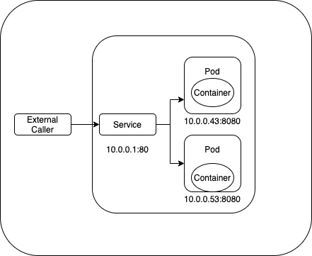

**Service** - in Kubernetes is an abstraction which defines a logical set of Pods and a policy by which to access them. It provides the stable address for a pod(s), not ephemeral. And load balances between a pods.

</p>

</details>

---

<details>

  <summary> 75. What are the different types of Services available ? </summary>

  <p>

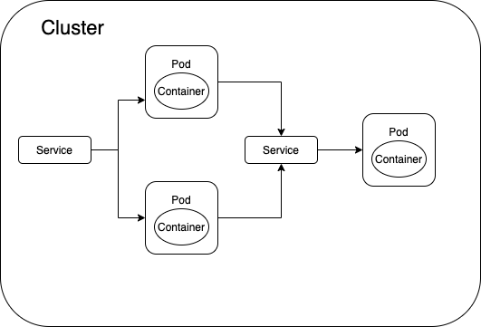

- **ClusterIP** - It is the default service type. Exposes the Service on a cluster-internal IP. Only reachable within cluster. Pods can reach service on apps port number.

```YAML
apiVersion: v1
kind: Service
metadata:
  name: my-service
spec:
  selector:
    app: nginx
  ports:
    - protocol: http
      port: 80
      targetPort: 80
```

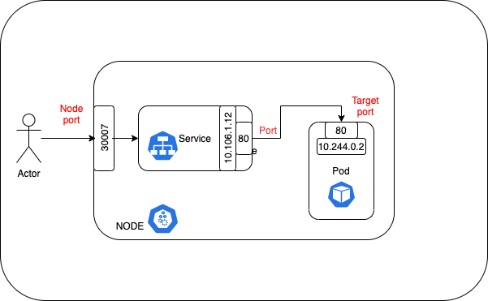

- **NodePort** - Exposes the Service on each Node's IP at a static port (the NodePort). High port allocated on each node. You'll be able to contact the NodePort Service, from outside the cluster, by requesting <NodeIP>:<NodePort>

```YAML
apiVersion: v1
kind: Service
metadata:
  name: my-service
spec:
  type: NodePort
  selector:
    app: MyApp
  ports:
    - port: 80 # the port where service is running
      targetPort: 80 # port on the pod where actual web-serer is running
      # Optional field. You can specify your own nodePort value in the 30000--32767 range.
      # By default and for convenience, the Kubernetes control plane will allocate a port from a range (default: 30000-32767)
      nodePort: 30007
```

- **LoadBalancer** - Exposes the Service externally using a cloud provider's load balancer. NodePort and ClusterIP Services, to which the external load balancer routes, are automatically created.

```YAML
apiVersion: v1
kind: Service
metadata:
  name: my-service
spec:
  selector:
    app: MyApp
  ports:
    - protocol: TCP
      port: 80
      targetPort: 9376
  clusterIP: 10.0.171.239
  type: LoadBalancer
status:
  loadBalancer:
    ingress:
    - ip: 192.0.2.127
```

- **ExternalName** - Maps the Service to the contents of the externalName field (e.g. foo.bar.example.com), by returning a CNAME record with its value. No proxying of any kind is set up.

```YAML
apiVersion: v1
kind: Service
metadata:
  name: my-service
spec:
  type: ExternalName
  externalName: my.database.example.com
```

  </p>

</details>

---

<details>

  <summary> 76. How does the ClusterIP works ? </summary>

  <p>

It is the default service type. Exposes the Service on a cluster-internal IP. Only reachable within cluster (nodes and pods). Pods can reach service on apps port number.

1. Create an deployment

```console
kubectl create deployment hello-node --image=k8s.gcr.io/echoserver:1.4
```

2. Scale it two.

```console
kubectl scale deploy/hello-node --replicas=2
```

3. Create a service

```console
kubectl expose deployment hello-node --port=8080
```

4.  Get the pods list

```console
kubectl get pods
```

5.  Get into the shell for one of the pod

```console
kubectl exec -it pod/hello-node-7567d9fdc9-qxtjt -- bin/bash
```

6. Access the other pod

```console
curl hello-node:8080
```

  </p>

</details>

---

<details>

  <summary> 77. How does the NodePort service works ? </summary>

  <p>

Exposes the Service on each Node's IP at a static port (the NodePort). High port allocated on each node. You'll be able to contact the NodePort Service, from outside the cluster, by requesting <NodeIP>:<NodePort>

1. Create an deployment

```console
  kubectl create deployment hello-node --image=k8s.gcr.io/echoserver:1.4
```

2. Create a service

```console
kubectl expose deployment hello-node --port=8080 --type=NodePort
```

3. Open the exposed service in minikube

```console
minikube service hello-node
```

  </p>

</details>

---

<details>

  <summary> 78. What are the ways to get list of available keys for k8s object/kind ? </summary>

  <p>

To get all the keys for a specific object/kind.

```console
kubectl explain services --recursive
```

To get the keys for a specific resource, and also with what value type it supports.

```console
kubectl explain services.spec

kubectl explain services.spec.type # specific to a single key.
```

  </p>

</details>

---

<details>

  <summary> 79. What is the use of a `diff` command ? </summary>

  <p>

`kubectl diff` shows the differences (changes made) between the current "live" object and the new "dry-run" object.

Syntax:

```console
kubectl diff -f some-resources.yaml
```

  </p>

</details>

---

<details>

  <summary> 80. How to create nginx deployment and service using declarative approach ?  </summary>

  <p>

Use the `apply` command

1. Create a nginx deployment and service

```console
kubectl apply -f ./k8s-files/ex-1-nginx/nginx-deployment.yml
kubectl apply -f ./k8s-files/ex-1-nginx/nginx-service.yml
```

2. Create a nginx deployment and get into the shell

```
kubectl run nginx-standalone --image=nginx
kubectl exec -it nginx-standalone -- sh
```

3. Now access the nginx deployment using the service from inside the pod

```
curl nginx-service:8080
```

  </p>

</details>

---

<details>

  <summary> 81. How does Port, TargetPort, ContainerPort, and NodePort works ? </summary>

  <p>

- **Port** - The port of this service. Other pods in the cluster that may need to access the service will just use port.

- **TargetPort** - it forwards the traffic to `ContainerPort` (where the app might be listening). Also, if targetPort is not set, it will default to the same value as port

- **ContainerPort** - it purpose is for adding additional information.

- **NodePort** - makes the service visible outside the Kubernetes cluster by the node’s IP address and the port number

Flow - Traffic comes in on `NodePort` , forwards to `Port` on the service which then routes to `TargetPort` on the pod(s) and in turn it routes to `ContainerPort` (if TargetPort and ContainerPort matches).

1. Create deployment and service

```console
kubectl apply -f ./k8s-files/ex-2-ports/deployment.yml
kubectl apply -f ./k8s-files/ex-2-ports/service.yml
```

2. To test usage of ports, create a ubuntu pod with interactive shell and install curl

```console
kubectl run -i --tty ubuntu --image=ubuntu --restart=Never -- sh
apt-get update; apt-get install curl # to install curl
```

3. Access nginx using the Port from within the cluster

```console
curl nginx-service:8080 # `hello-world` is the service name and `8080` is the port mentioned in the service.
```

4. Access nginx using the Port from outside the cluster

```console
kubectl describe pod nginx-deploy # this will list the NodeIP (Node: minikube/192.168.64.2)
```

Result:

The above command will fetch you the NodeIP and NodePort is have already mentioned in the `service.yml` file.

```
Name:         nginx-deploy-756d646fff-8848w
Namespace:    default
Priority:     0
Node:         minikube/192.168.64.2 # <=== NodeIP
Start Time:   Sat, 22 May 2021 22:13:20 +0530
Labels:       app=hello-world
pod-template-hash=756d646fff
...
...
```

5. You can access it from the browser using `NodeIP:NodePort` in this case `192.168.64.2:31234`.

  </p>

</details>

---

<details>

  <summary> 82. What is Ingress ? </summary>

  <p>


**Ingress** exposes HTTP and HTTPS routes from outside the cluster to services within the cluster. Traffic routing is controlled by rules defined on the Ingress resource (e.g. load balancing, SSL termination,path-based routing, protocol).

The advantage of an Ingress over a LoadBalancer is that an Ingress can consolidate routing rules in a single resource to expose multiple services.

Example:

```YAML
apiVersion: networking.k8s.io/v1
kind: Ingress
metadata:
  name: dashboard-ingress
  namespace: kubernetes-dashboard
spec:
  rules:
  - host: my-app.com # Valid domain address, map domain name to IP address of the entry node and any incoming request must be forwarded to internal service
    http:
      paths:  # Incoming urls matching the path are forwarded to the backend.
      - backend:
          serviceName: my-internal-service # service name and port should correspond to the name of internal service
          servicePort: 80
```

  </p>

</details>

---

<details>

  <summary> 83. What is ingress controller ? What is the use of it ? </summary>

  <p>


An Ingress controller is responsible for fulfilling the Ingress, by evaluating all the rules, managing re-directions, acts as an entrypoint to the cluster.

There many Ingress controller are available, HAProxy Ingress, NGINX Ingress Controller, Traefik, and AKS (azure).

  </p>

</details>

---

<details>

  <summary>  84. How does ingress works in practically ? </summary>

  <p>

1. Enable ingress addons in minikube

```console
minikube addons enable ingress
```

Which automatically starts k8s nginx implementation of Ingress controller.

2. Now we are going to route incoming request to minikube k8s dashboard(right now it is not accessible to outside cluster)


If you don't see the kubernetes dashboard, execute `minikube dashboard`

```console
kubectl apply -f ./k8s-files/ex-3-ingress/ingress.yml
```

```console
kubectl get ingress -n kubernetes-dashboard # get the address
```

Result:

```
NAME                CLASS    HOSTS           ADDRESS        PORTS   AGE
dashboard-ingress   none   dashboard.com   192.168.64.2   80      84s
```

```
# if Nginx Ingress: service “ingress-nginx-controller-admission” not found; execute the below command
# kubectl delete -A ValidatingWebhookConfiguration ingress-nginx-admission
```

3. Map the IP address to domain name (doing it locally)

```console
sudo vi /etc/hosts
```

And configure the IP address and domain name


4. Go to browser and type dashboard.com, it will re-direct to the kubernetes dashboard.

Note: After exercise don't forget to remove domain mapping from `/etc/hosts` otherwise it will always try to reach that IP address

  </p>

</details>

---

<details>

  <summary> 85. What happens if an incoming request not mapped to any of the backend service ? </summary>

  <p>

Kubernetes has the default backend running.

Syntax:

```console
kubectl describe ingress <ingress-name> -n <namespace>
```

Example:

```console
kubectl describe ingress dashboard-ingress -n kubernetes-dashboard
```

w.r.t to previous example `dashboard.com/eat` will result in `404 page not found`

  </p>

</details>

---

<details>

  <summary> 86. What are the different use cases of ingress ? </summary>

  <p>

1. Multiple path for same host

```YAML
apiVersion: networking.k8s.io/v1
kind: Ingress
metadata:
  name: simple-example
spec:
  rules:
  - host: www.test.com
    http:
      paths:
      - path: /foo # it will be routed here if users hits www.test.com/foo
        pathType: Prefix
        backend:
          service:
            name: service1
            port:
              number: 4200
      - path: /bar # it will be routed here if users hits www.test.com/bar
        pathType: Prefix
        backend:
          service:
            name: service2
            port:
              number: 8080
```

2. Multiple sub-domains or domains

```YAML
apiVersion: networking.k8s.io/v1
kind: Ingress
metadata:
  name: name-virtual-host-ingress
spec:
  rules:
  - host: foo.app.com
    http:
      paths:
      - pathType: Prefix
        path: "/"
        backend:
          service:
            name: service1
            port:
              number: 80
  - host: bar.app.com
    http:
      paths:
      - pathType: Prefix
        path: "/"
        backend:
          service:
            name: service2
            port:
              number: 80
```

3. Configuring TLS (Transport Layer Security)

```YAML
apiVersion: v1
kind: Secret
metadata:
  name: test-secret-tls
  namespace: default
data:
  tls.crt: base64 encoded cert
  tls.key: base64 encoded key
type: kubernetes.io/tls
```

  </p>

</details>

---

<details>

  <summary> 87. What is Network Policy and how does it works ? </summary>

  <p>

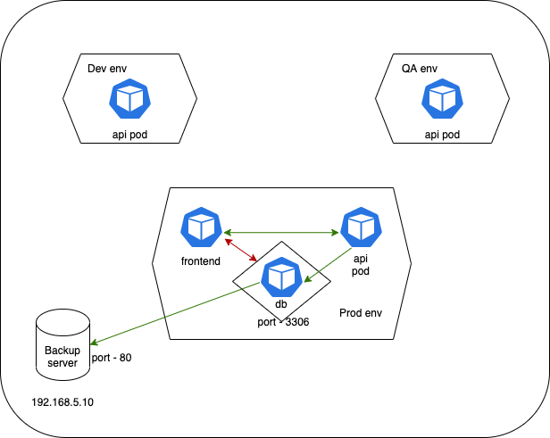

Network policies allow you to limit connections between Pods. It provides security by restricting access to and from the pods.

Network policies are implemented by the network plugin. To use network policies, you must be using a networking solution which supports NetworkPolicy. Creating a NetworkPolicy resource without a controller that implements it will have no effect.

```YAML
apiVersion: networking.k8s.io/v1
kind: NetworkPolicy
metadata:
  name: db-policy
  namespace: default
spec:
  podSelector:
    matchLabels:
      role: db
  policyTypes:
    - Ingress # request coming in to db pod
    - Egress # request going out from db pod
  ingress:
    - from:
        - podSelector:
            matchLabels:
              name: api-pod
          namespaceSelector:
            matchLabels:
              name: prod
      ports:
        - protocol: TCP
          port: 3000
  egress:
    - to:
        - podSelector:
            matchLabels:
              name: api-pod
      ports:
        - protocol: TCP
          port: 5000
```

  </p>

</details>

---

<details>

  <summary> 88. Why do we need to store data in k8s ? </summary>

  <p>

Data/files in a containers/pods are ephemeral (lasts only for a short period of time), once the container crashes or removed, data (ex: mysql data or logs of the server) inside the container will lost. To avoid such scenario, data must be stored.

  </p>

</details>

---

<details>

  <summary> 89. What is volumes in k8s ? How does it works ? </summary>

  <p>

Volume is a directory (references a storage location), possibly with some data in it, which is accessible to the containers in a pod. When a volume is attached to the pod, and all the containers inside this pod have access to the volume. This way data can be shared between different containers running on the same pod.

Kubernetes provides many directory types like

- **emptyDir** empty directory for storing data, useful for sharing files between containers. It is tied to the lifetime of the pod.
- **hostPath** mounts a file or directory from the host node's filesystem into your Pod. It is tied to the node.
- **nfs** allows an existing NFS (Network File System) share to be mounted into a Pod.
- **secret/configMap** provides a pod with access to kubernetes resources.
- **cloud** cluster wide storage.

... etc.

</p>

</details>

---

<details>

<summary> 90. How does volumes works in k8s ? </summary>

<p>

Example 1:

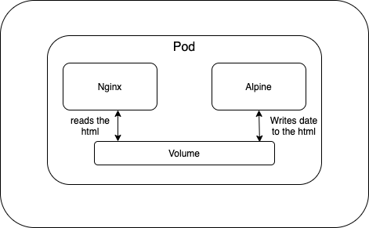

1. Create a nginx and alpine with emptyDir volume

```
kubectl apply -f k8s-files/volumes/nginx-alpine.yml
```

2. Port forward

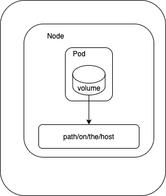

```
kubectl port-forward nginx-alpine-volume 8080:80
```

Example 2:

1. Mount your host machine path into a minikube vm (if you happen to use it)

```console
 minikube mount $PWD/k8s-files/volumes:/opt
```

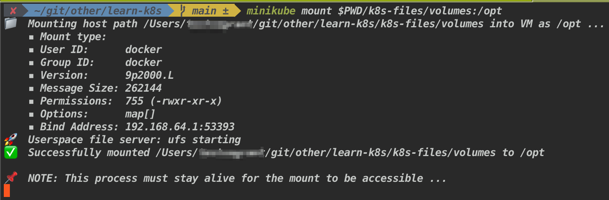

Note: Or else you can ssh into minikube `minikube ssh` try it out

2. Apply volumes.yml file

```console
kubectl apply -f k8s-files/volumes/volumes.yml
```

3. Look inside the folder

Look inside the `k8s-files/volumes/` there will be a `number.out` file will be created with some random number in it.

 </p>

</details>

---

<details>

  <summary> 90. What is persistent volume ? How does it works ? </summary>

  <p>

**Persistent volume:** - A PersistentVolume (PV) is a piece of storage in the cluster that has been provisioned by an administrator or dynamically provisioned using Storage Classes. PersistentVolumes are a cluster-level resource like nodes, which don’t belong to any namespace. So it is available to pod even it it gets scheduled to a different node.

```YAML
kind: PersistentVolume
apiVersion: v1
metadata:
  name: pv-demo
spec:
  capacity:
    storage: 1Gi
  accessModes:
    - ReadWriteOnce
  gcePersistentDisk:
    pdName: my-data-disk
    fsType: ext4
```

- Create a persistent volume

```console
kubectl apply -f k8s-files/persistent-volume/persistent-volume.yml
```

- View created persistent volume

```console
kubectl get pv
```

  </p>

</details>

---

<details>

  <summary> 91. What is persistent volume claim ? How does it works ?  </summary>

  <p>

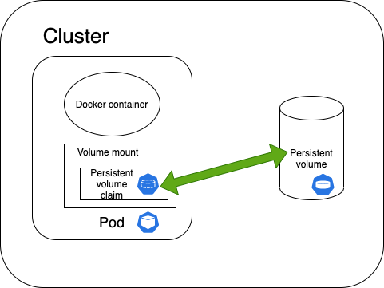

A PersistentVolumeClaim (PVC) is a request for storage by a user. It is a specifc request for a resource with attributes, such as storage size, access modes. It (PVC) matches a claim to an available volume (PV) and binds them together. This allows the claim to be used as a volume in a pod.

1. Creating a PVC that matches to an available PersistentVolume (PV)

```YAML
apiVersion: v1
kind: PersistentVolumeClaim
metadata:
  name: "claim1"
spec:
  accessModes:
    - "ReadWriteOnce"
  resources:
    requests:
      storage: "1Gi"
```

2. View the create persistent volume claim

```console
kubectl get pvc
```

3. Claim as volumes in pod

```YAML
apiVersion: "v1"
kind: "Pod"
metadata:
  name: "my-pod"
  labels:
    name: "frontend"
spec:
  containers:
    - name: "my-frontend"
      image: nginx
      ports:
        - containerPort: 80
          name: "http-server"
      volumeMounts:
        - mountPath: "/usr/share/nginx/html"
          name: "pvol"
  volumes:
    - name: "pvol"
      persistentVolumeClaim:
        claimName: "claim1"
```

  </p>

</details>

---

<details>

  <summary> 92. What is the difference between the volumes and persistent volumes ? </summary>

  <p>
  
`Volume` decouples the storage from the Container. Its lifecycle is coupled to a pod. It enables safe container restarts and sharing data between containers in a pod.

`Persistent Volume` decouples the storage from the Pod. Its lifecycle is independent. It enables safe pod restarts and sharing data between pods.

[Source](https://stackoverflow.com/a/54500752/5514320)

  </p>

</details>

---

<details>

  <summary> 93. What is Storage class ? And how to use it ? </summary>

  <p>
  
With a StorageClass, you don't need to create a persistent volume manually before claiming it. Storage Class comes with provisioner (GCEPersistentDisk, AzureDisk , AWSElasticBlockStore ...) that automatically creates the storage and attach that to the pods when a claim has been made.

1. Create a StorageClass object

```YAML
apiVersion: storage.k8s.io/v1
kind: StorageClass
metadata:
  name: slow
provisioner: kubernetes.io/gce-pd
parameters:
  type: pd-standard
  fstype: ext4
  replication-type: none
```

2. Claim it in PVC

```YAML
apiVersion: v1
kind: PersistentVolumeClaim
metadata:
  name: "claim1"
spec:
  accessModes:
    - "ReadWriteOnce"
  storageClassName: google-storage # this binds the StorageClass and PVC
  resources:
    requests:
      storage: "1Gi"
```

3. Use it in the pods

```YAML
apiVersion: "v1"
kind: "Pod"
metadata:
  name: "my-pod"
  labels:
    name: "frontend"
spec:
  containers:
    - name: "my-frontend"
      image: nginx
      ports:
        - containerPort: 80
          name: "http-server"
      volumeMounts:
        - mountPath: "/usr/share/nginx/html"
          name: "pvol"
  volumes:
    - name: "pvol"
persistentVolumeClaim:
        claimName: "claim1"
```

  </p>

</details>

---

<details>

  <summary> 94. What is StatefulSet ? What is the use of it ? </summary>

  <p>

**StatefulSets** are similar to Deployment sets in-terms of creating pods based on the yaml file. With StatefulSets pods are created deployed in sequential order and are terminated in reverse ordinal order. StatefulSets use an ordinal index for the identity and ordering each. Pods number starts from zero and incremented by one, each pods get uniques name derived from index combined with StatefulSet name. For example, a StatefulSet named web has its Pods named web-0, web-1, and web-2. StatefulSet maintains a sticky identity for each of their Pods.

1. Create StatefulSets

```console
kubectl apply -f k8s-files/stateful-sets/statefulsets.yml
```

2. View the created StatefulSets

```console
kubectl get statefulsets
```

  </p>

</details>

---

<details>

<summary> 95. What is headless Service in StatefulSets ? </summary>

<p>

</p>

</details>

---

<details>

  <summary> 95. What is the difference deployment and StatefulSet ? </summary>

  <p>

| Deployment                                               | StatefulSet                                                             |
| -------------------------------------------------------- | ----------------------------------------------------------------------- |
| Used to deploy stateless applications                    | Used to deploy stateful applications                                    |
| Pod names are unique                                     | Pod names are in sequential order                                       |
| PersistentVolumeClaim that is shared by all pod replicas | Each replica pod gets a unique PersistentVolumeClaim associated with it |

  </p>

</details>

---

<details>

  <summary> How to create an </summary>

  <p>

  </p>

</details>

---

<details>

  <summary> </summary>

  <p>

  </p>

</details>

---

<details>

  <summary> </summary>

  <p>

  </p>

</details>

---

<details>

  <summary> </summary>

  <p>

  </p>

</details>

---

## Resources

### Video series

- [Kubernetes Tutorial for Beginners - Tech with Nana](https://www.youtube.com/watch?v=X48VuDVv0do&t=2s)

- [Udemy - CKAD - Mumshad Mannambeth](https://www.udemy.com/course/certified-kubernetes-application-developer/learn/lecture/12321104#content)

- [Dan Wahlin, Nigel Poulton, Craig Golightly - CKAD - Pluralsight](https://www.pluralsight.com/paths/certified-kubernetes-application-developer-ckad)

### Learn by doing

- [k8s by example](https://www.kubernetesbyexample.com/)

- [100 days of k8s - Anais Urlichs](https://100daysofkubernetes.io/)

- [Collabnix k8s](https://collabnix.github.io/kubelabs/)

- [k8s practical problems](https://github.com/kubernauts/practical-kubernetes-problems)

- [k8s examples](https://k8s-examples.container-solutions.com/)

- [k8s resource](https://gist.github.com/dims/bb219a4a8d9cb88dc2a2dc1f11a537c6)

### Articles

- [Kubernetes handbook](https://www.freecodecamp.org/news/the-kubernetes-handbook/)

- [Kubernetes official doc](https://kubernetes.io/docs/home/)

- [Collection of Kubernetes tutorial](https://www.aquasec.com/cloud-native-academy/kubernetes-101/kubernetes-tutorials/)

- [Matthew Palmer articles on k8s](https://matthewpalmer.net/kubernetes-app-developer/articles/)

- [Kubernetes articles](https://www.magalix.com/hs-search-results?term=kubernetes&type=SITE_PAGE&type=BLOG_POST&type=LISTING_PAGE)

### CKAD

- [CKAD exercises](https://github.com/dgkanatsios/CKAD-exercises)

- [CKAD prep notes](https://github.com/twajr/ckad-prep-notes)

- [CKAD resources](https://github.com/lucassha/CKAD-resources)

- [CKAD practice questions](https://github.com/bbachi/CKAD-Practice-Questions)

- [CKAD crash course](https://github.com/bmuschko/ckad-crash-course)

- [CKAD prep](https://github.com/bmuschko/ckad-prep)

### CKA

- [CKA kodekloud docs](https://github.com/kodekloudhub/certified-kubernetes-administrator-course)

### Interesting reads

- [What happens when k8s](https://github.com/jamiehannaford/what-happens-when-k8s)
